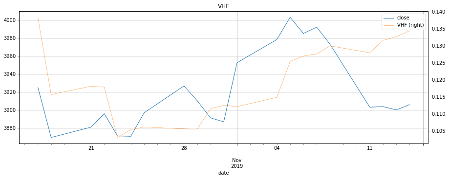

```python
import os
import sys
sys.path.append(os.path.abspath(os.path.join(os.getcwd(), '..')))

import pandas as pd
pd.core.common.is_list_like = pd.api.types.is_list_like
try:
    import empyrical as emp
except:
    emp = None
import tushare as ts
import time
import random
# from concurrent.futures import ProcessPoolExecutor

from common.log import *
from common.config import Config
from spider.spider_nasdaq import Spider_nasdaq
from spider.spider_coinmarketcap import Spider_coinmarketcap

from IPython.core.interactiveshell import InteractiveShell
InteractiveShell.ast_node_interactivity = 'all'

from pandas_highcharts.core import serialize
from pandas_highcharts.display import display_charts

from IPython.core.display import display, HTML
# display(HTML("<style>.container { width:70% !important; }</style>"))

CONF = Config('../conf/secret.yaml').data[0]
ts_token = CONF['TUSHARE']['TOKEN']
ts.set_token(ts_token)
pro = ts.pro_api()

CONF = Config().data[0]
MONGODB = CONF['MONGODB']
NASDAQ = CONF['NASDAQ']
CRYPTOCURRENCY = CONF['CRYPTOCURRENCY']
CRYPTOCURRENCY = list(CRYPTOCURRENCY.keys())
NASDAQ100 = CONF['NASDAQ100']

TEST_LIST = ['399300']

pd
```


<script src="https://code.jquery.com/jquery-3.1.1.min.js"></script>
<script src="https://code.highcharts.com/stock/highstock.js"></script>
<script src="https://code.highcharts.com/stock/modules/exporting.js"></script>
<script src="https://code.highcharts.com/stock/modules/export-data.js"></script>


    <module 'pandas' from 'd:\\python3\\lib\\site-packages\\pandas\\__init__.py'>


```python
%%time

stock_df_dict = {}

for symbol in TEST_LIST:
    stock_data_file = '../database/market/%s.csv' % symbol
    try:
        stock_df = pd.read_csv(stock_data_file)
    except:
        print(symbol)
        continue

    # 筛选字段
#     stock_df = stock_df.loc[:, ['date', 'open', 'close']]
    
    # 特殊处理，用当天收盘价做判定和交易
#     stock_df['open'] = stock_df['close']

    # 去掉Nasdaq行情首行的当天行情
    if symbol in NASDAQ100:
        stock_df = stock_df.drop([0])

    # 抛弃空值异常值
    stock_df.dropna(axis=0, how='any', inplace=True)

    # 格式化日期
    # 445 ms ± 17.5 ms per loop (mean ± std. dev. of 7 runs, 1 loop each)
    stock_df = stock_df.assign(date=pd.to_datetime(stock_df['date']))  # need .index.to_period('D')

    # 用日期作索引，日期升序排序
    # 95.1 µs ± 1.58 µs per loop (mean ± std. dev. of 7 runs, 10000 loops each)
    if symbol in NASDAQ100 or symbol in CRYPTOCURRENCY:
        stock_df = stock_df[::-1]
    stock_df.set_index(['date'], inplace=True)
    stock_df.index = stock_df.index.to_period('D')

    # 计算每天涨跌幅
#     stock_df['o_pct_chg'] = stock_df.open.pct_change(1)
#     stock_df['c_o_pct_chg'] = (stock_df.open - stock_df.close.shift(1)) / stock_df.close.shift(1)
#     stock_df['N_chg'] = stock_df.open.pct_change(N)
    # 用昨天收盘价做判定
#     stock_df['N_chg'] = (stock_df.close.shift(1) - stock_df.close.shift(N)) / stock_df.close.shift(N)
#     stock_df['N_sht'] = stock_df.open.shift(N)
#     stock_df['N_chn'] = stock_df.open.shift(N) - stock_df.open
#     stock_df['y_close'] = stock_df.close.shift(1)
    
    # MA均线指标
#     stock_df['MA%d' % M] = stock_df['open'].rolling(M).mean()
#     stock_df['MA%d' % M] = stock_df['close'].rolling(M).mean().shift(1)
    
    # 减少数据
    stock_df.dropna(how='any', inplace=True)
    
    stock_df_dict[symbol] = stock_df
```

    Wall time: 73.1 ms
    


```python
for symbol in TEST_LIST:
    symbol
    stock_df_dict[symbol].head(2)
    stock_df_dict[symbol].tail(2)
```


    '399300'


<div>
<style scoped>
    .dataframe tbody tr th:only-of-type {
        vertical-align: middle;
    }

    .dataframe tbody tr th {
        vertical-align: top;
    }

    .dataframe thead th {
        text-align: right;
    }
</style>
<table border="1" class="dataframe">
  <thead>
    <tr style="text-align: right;">
      <th></th>
      <th>open</th>
      <th>close</th>
      <th>high</th>
      <th>low</th>
      <th>volume</th>
      <th>code</th>
    </tr>
    <tr>
      <th>date</th>
      <th></th>
      <th></th>
      <th></th>
      <th></th>
      <th></th>
      <th></th>
    </tr>
  </thead>
  <tbody>
    <tr>
      <th>2005-04-08</th>
      <td>984.66</td>
      <td>1003.45</td>
      <td>1003.70</td>
      <td>979.53</td>
      <td>14762500.0</td>
      <td>sz399300</td>
    </tr>
    <tr>
      <th>2005-04-11</th>
      <td>1003.88</td>
      <td>995.42</td>
      <td>1008.73</td>
      <td>992.77</td>
      <td>15936100.0</td>
      <td>sz399300</td>
    </tr>
  </tbody>
</table>
</div>


<div>
<style scoped>
    .dataframe tbody tr th:only-of-type {
        vertical-align: middle;
    }

    .dataframe tbody tr th {
        vertical-align: top;
    }

    .dataframe thead th {
        text-align: right;
    }
</style>
<table border="1" class="dataframe">
  <thead>
    <tr style="text-align: right;">
      <th></th>
      <th>open</th>
      <th>close</th>
      <th>high</th>
      <th>low</th>
      <th>volume</th>
      <th>code</th>
    </tr>
    <tr>
      <th>date</th>
      <th></th>
      <th></th>
      <th></th>
      <th></th>
      <th></th>
      <th></th>
    </tr>
  </thead>
  <tbody>
    <tr>
      <th>2019-11-13</th>
      <td>3905.28</td>
      <td>3899.98</td>
      <td>3908.42</td>
      <td>3882.43</td>
      <td>76749078.0</td>
      <td>sz399300</td>
    </tr>
    <tr>
      <th>2019-11-14</th>
      <td>3905.93</td>
      <td>3905.86</td>
      <td>3916.95</td>
      <td>3895.14</td>
      <td>87008446.0</td>
      <td>sz399300</td>
    </tr>
  </tbody>
</table>
</div>


```python
'''
Select the number of periods (n) to include in the indicator. 
This should be based on the length of the cycle that you are analyzing. 
The most popular is 28 days (for intermediate cycles).
Determine the highest closing price (HCP) in n periods.
Determine the lowest closing price (LCP) in n periods.
Calculate the range of closing prices in n periods:
           HCP - LCP
Next, calculate the movement in closing price for each period:
           Closing price [today] - Closing price [yesterday]
Add up all price movements for n periods, disregarding whether they are up or down:
           Sum of absolute values of ( Close [today] - Close [yesterday] ) for n periods
Divide Step 4 by Step 6:
           VHF = (HCP - LCP) / (Sum of absolute values for n periods)
'''
```


    '\nSelect the number of periods (n) to include in the indicator. \nThis should be based on the length of the cycle that you are analyzing. \nThe most popular is 28 days (for intermediate cycles).\nDetermine the highest closing price (HCP) in n periods.\nDetermine the lowest closing price (LCP) in n periods.\nCalculate the range of closing prices in n periods:\n           HCP - LCP\nNext, calculate the movement in closing price for each period:\n           Closing price [today] - Closing price [yesterday]\nAdd up all price movements for n periods, disregarding whether they are up or down:\n           Sum of absolute values of ( Close [today] - Close [yesterday] ) for n periods\nDivide Step 4 by Step 6:\n           VHF = (HCP - LCP) / (Sum of absolute values for n periods)\n'


```python
df = stock_df_dict['399300'].copy()
N = 120
df['CLOSE_MA'] = df['close'].rolling(N).mean()
# df['close'] = df['CLOSE_MA']
df['HCP'] = df['close'].rolling(N).max()
df['LCP'] = df['close'].rolling(N).min()
df['DIFFCP'] = df['close'] - df['close'].shift()
df['DIFFCP'] = df['DIFFCP'].apply(abs)
df['SUMDIFFCP'] = df['DIFFCP'].rolling(N).sum()
df['VHF'] = (df['HCP'] - df['LCP']) / df['SUMDIFFCP']
df['VHF_MA'] = df['VHF'].rolling(N).mean()
df
o_df = df.copy()
```


<div>
<style scoped>
    .dataframe tbody tr th:only-of-type {
        vertical-align: middle;
    }

    .dataframe tbody tr th {
        vertical-align: top;
    }

    .dataframe thead th {
        text-align: right;
    }
</style>
<table border="1" class="dataframe">
  <thead>
    <tr style="text-align: right;">
      <th></th>
      <th>open</th>
      <th>close</th>
      <th>high</th>
      <th>low</th>
      <th>volume</th>
      <th>code</th>
      <th>CLOSE_MA</th>
      <th>HCP</th>
      <th>LCP</th>
      <th>DIFFCP</th>
      <th>SUMDIFFCP</th>
      <th>VHF</th>
      <th>VHF_MA</th>
    </tr>
    <tr>
      <th>date</th>
      <th></th>
      <th></th>
      <th></th>
      <th></th>
      <th></th>
      <th></th>
      <th></th>
      <th></th>
      <th></th>
      <th></th>
      <th></th>
      <th></th>
      <th></th>
    </tr>
  </thead>
  <tbody>
    <tr>
      <th>2005-04-08</th>
      <td>984.66</td>
      <td>1003.45</td>
      <td>1003.70</td>
      <td>979.53</td>
      <td>14762500.0</td>
      <td>sz399300</td>
      <td>NaN</td>
      <td>NaN</td>
      <td>NaN</td>
      <td>NaN</td>
      <td>NaN</td>
      <td>NaN</td>
      <td>NaN</td>
    </tr>
    <tr>
      <th>2005-04-11</th>
      <td>1003.88</td>
      <td>995.42</td>
      <td>1008.73</td>
      <td>992.77</td>
      <td>15936100.0</td>
      <td>sz399300</td>
      <td>NaN</td>
      <td>NaN</td>
      <td>NaN</td>
      <td>8.03</td>
      <td>NaN</td>
      <td>NaN</td>
      <td>NaN</td>
    </tr>
    <tr>
      <th>2005-04-12</th>
      <td>993.71</td>
      <td>978.70</td>
      <td>993.71</td>
      <td>978.20</td>
      <td>10226200.0</td>
      <td>sz399300</td>
      <td>NaN</td>
      <td>NaN</td>
      <td>NaN</td>
      <td>16.72</td>
      <td>NaN</td>
      <td>NaN</td>
      <td>NaN</td>
    </tr>
    <tr>
      <th>2005-04-13</th>
      <td>987.95</td>
      <td>1000.90</td>
      <td>1006.50</td>
      <td>987.95</td>
      <td>16071700.0</td>
      <td>sz399300</td>
      <td>NaN</td>
      <td>NaN</td>
      <td>NaN</td>
      <td>22.20</td>
      <td>NaN</td>
      <td>NaN</td>
      <td>NaN</td>
    </tr>
    <tr>
      <th>2005-04-14</th>
      <td>1004.64</td>
      <td>986.97</td>
      <td>1006.42</td>
      <td>985.58</td>
      <td>12945700.0</td>
      <td>sz399300</td>
      <td>NaN</td>
      <td>NaN</td>
      <td>NaN</td>
      <td>13.93</td>
      <td>NaN</td>
      <td>NaN</td>
      <td>NaN</td>
    </tr>
    <tr>
      <th>2005-04-15</th>
      <td>982.61</td>
      <td>974.08</td>
      <td>982.61</td>
      <td>971.93</td>
      <td>10409000.0</td>
      <td>sz399300</td>
      <td>NaN</td>
      <td>NaN</td>
      <td>NaN</td>
      <td>12.89</td>
      <td>NaN</td>
      <td>NaN</td>
      <td>NaN</td>
    </tr>
    <tr>
      <th>2005-04-18</th>
      <td>970.91</td>
      <td>963.77</td>
      <td>970.91</td>
      <td>958.65</td>
      <td>8598400.0</td>
      <td>sz399300</td>
      <td>NaN</td>
      <td>NaN</td>
      <td>NaN</td>
      <td>10.31</td>
      <td>NaN</td>
      <td>NaN</td>
      <td>NaN</td>
    </tr>
    <tr>
      <th>2005-04-19</th>
      <td>962.92</td>
      <td>965.89</td>
      <td>968.87</td>
      <td>957.91</td>
      <td>9212620.0</td>
      <td>sz399300</td>
      <td>NaN</td>
      <td>NaN</td>
      <td>NaN</td>
      <td>2.12</td>
      <td>NaN</td>
      <td>NaN</td>
      <td>NaN</td>
    </tr>
    <tr>
      <th>2005-04-20</th>
      <td>964.15</td>
      <td>950.87</td>
      <td>964.15</td>
      <td>946.20</td>
      <td>8850700.0</td>
      <td>sz399300</td>
      <td>NaN</td>
      <td>NaN</td>
      <td>NaN</td>
      <td>15.02</td>
      <td>NaN</td>
      <td>NaN</td>
      <td>NaN</td>
    </tr>
    <tr>
      <th>2005-04-21</th>
      <td>948.86</td>
      <td>943.98</td>
      <td>955.55</td>
      <td>938.59</td>
      <td>9946150.0</td>
      <td>sz399300</td>
      <td>NaN</td>
      <td>NaN</td>
      <td>NaN</td>
      <td>6.89</td>
      <td>NaN</td>
      <td>NaN</td>
      <td>NaN</td>
    </tr>
    <tr>
      <th>2005-04-22</th>
      <td>942.91</td>
      <td>939.10</td>
      <td>947.91</td>
      <td>934.96</td>
      <td>10691900.0</td>
      <td>sz399300</td>
      <td>NaN</td>
      <td>NaN</td>
      <td>NaN</td>
      <td>4.88</td>
      <td>NaN</td>
      <td>NaN</td>
      <td>NaN</td>
    </tr>
    <tr>
      <th>2005-04-25</th>
      <td>935.99</td>
      <td>930.07</td>
      <td>935.99</td>
      <td>920.16</td>
      <td>11470500.0</td>
      <td>sz399300</td>
      <td>NaN</td>
      <td>NaN</td>
      <td>NaN</td>
      <td>9.03</td>
      <td>NaN</td>
      <td>NaN</td>
      <td>NaN</td>
    </tr>
    <tr>
      <th>2005-04-26</th>
      <td>928.43</td>
      <td>937.08</td>
      <td>939.70</td>
      <td>924.66</td>
      <td>11690500.0</td>
      <td>sz399300</td>
      <td>NaN</td>
      <td>NaN</td>
      <td>NaN</td>
      <td>7.01</td>
      <td>NaN</td>
      <td>NaN</td>
      <td>NaN</td>
    </tr>
    <tr>
      <th>2005-04-27</th>
      <td>938.57</td>
      <td>926.60</td>
      <td>938.91</td>
      <td>925.90</td>
      <td>10780600.0</td>
      <td>sz399300</td>
      <td>NaN</td>
      <td>NaN</td>
      <td>NaN</td>
      <td>10.48</td>
      <td>NaN</td>
      <td>NaN</td>
      <td>NaN</td>
    </tr>
    <tr>
      <th>2005-04-28</th>
      <td>923.53</td>
      <td>942.07</td>
      <td>945.50</td>
      <td>914.83</td>
      <td>14343500.0</td>
      <td>sz399300</td>
      <td>NaN</td>
      <td>NaN</td>
      <td>NaN</td>
      <td>15.47</td>
      <td>NaN</td>
      <td>NaN</td>
      <td>NaN</td>
    </tr>
    <tr>
      <th>2005-04-29</th>
      <td>940.81</td>
      <td>932.40</td>
      <td>942.45</td>
      <td>929.81</td>
      <td>11235400.0</td>
      <td>sz399300</td>
      <td>NaN</td>
      <td>NaN</td>
      <td>NaN</td>
      <td>9.67</td>
      <td>NaN</td>
      <td>NaN</td>
      <td>NaN</td>
    </tr>
    <tr>
      <th>2005-05-09</th>
      <td>934.65</td>
      <td>909.17</td>
      <td>937.39</td>
      <td>909.17</td>
      <td>8529110.0</td>
      <td>sz399300</td>
      <td>NaN</td>
      <td>NaN</td>
      <td>NaN</td>
      <td>23.23</td>
      <td>NaN</td>
      <td>NaN</td>
      <td>NaN</td>
    </tr>
    <tr>
      <th>2005-05-10</th>
      <td>905.54</td>
      <td>913.08</td>
      <td>913.39</td>
      <td>892.31</td>
      <td>10494300.0</td>
      <td>sz399300</td>
      <td>NaN</td>
      <td>NaN</td>
      <td>NaN</td>
      <td>3.91</td>
      <td>NaN</td>
      <td>NaN</td>
      <td>NaN</td>
    </tr>
    <tr>
      <th>2005-05-11</th>
      <td>911.84</td>
      <td>901.85</td>
      <td>917.22</td>
      <td>900.44</td>
      <td>9042050.0</td>
      <td>sz399300</td>
      <td>NaN</td>
      <td>NaN</td>
      <td>NaN</td>
      <td>11.23</td>
      <td>NaN</td>
      <td>NaN</td>
      <td>NaN</td>
    </tr>
    <tr>
      <th>2005-05-12</th>
      <td>899.97</td>
      <td>885.82</td>
      <td>900.06</td>
      <td>883.51</td>
      <td>10228700.0</td>
      <td>sz399300</td>
      <td>NaN</td>
      <td>NaN</td>
      <td>NaN</td>
      <td>16.03</td>
      <td>NaN</td>
      <td>NaN</td>
      <td>NaN</td>
    </tr>
    <tr>
      <th>2005-05-13</th>
      <td>883.51</td>
      <td>887.54</td>
      <td>898.51</td>
      <td>875.58</td>
      <td>11244900.0</td>
      <td>sz399300</td>
      <td>NaN</td>
      <td>NaN</td>
      <td>NaN</td>
      <td>1.72</td>
      <td>NaN</td>
      <td>NaN</td>
      <td>NaN</td>
    </tr>
    <tr>
      <th>2005-05-16</th>
      <td>885.39</td>
      <td>875.27</td>
      <td>885.39</td>
      <td>869.33</td>
      <td>8224289.0</td>
      <td>sz399300</td>
      <td>NaN</td>
      <td>NaN</td>
      <td>NaN</td>
      <td>12.27</td>
      <td>NaN</td>
      <td>NaN</td>
      <td>NaN</td>
    </tr>
    <tr>
      <th>2005-05-17</th>
      <td>873.08</td>
      <td>881.46</td>
      <td>888.28</td>
      <td>868.21</td>
      <td>8772270.0</td>
      <td>sz399300</td>
      <td>NaN</td>
      <td>NaN</td>
      <td>NaN</td>
      <td>6.19</td>
      <td>NaN</td>
      <td>NaN</td>
      <td>NaN</td>
    </tr>
    <tr>
      <th>2005-05-18</th>
      <td>881.14</td>
      <td>883.20</td>
      <td>890.40</td>
      <td>871.82</td>
      <td>7878610.0</td>
      <td>sz399300</td>
      <td>NaN</td>
      <td>NaN</td>
      <td>NaN</td>
      <td>1.74</td>
      <td>NaN</td>
      <td>NaN</td>
      <td>NaN</td>
    </tr>
    <tr>
      <th>2005-05-19</th>
      <td>882.84</td>
      <td>884.17</td>
      <td>888.02</td>
      <td>871.29</td>
      <td>8149579.0</td>
      <td>sz399300</td>
      <td>NaN</td>
      <td>NaN</td>
      <td>NaN</td>
      <td>0.97</td>
      <td>NaN</td>
      <td>NaN</td>
      <td>NaN</td>
    </tr>
    <tr>
      <th>2005-05-20</th>
      <td>883.51</td>
      <td>882.76</td>
      <td>891.02</td>
      <td>879.18</td>
      <td>7226679.0</td>
      <td>sz399300</td>
      <td>NaN</td>
      <td>NaN</td>
      <td>NaN</td>
      <td>1.41</td>
      <td>NaN</td>
      <td>NaN</td>
      <td>NaN</td>
    </tr>
    <tr>
      <th>2005-05-23</th>
      <td>880.28</td>
      <td>863.34</td>
      <td>880.28</td>
      <td>862.10</td>
      <td>7279800.0</td>
      <td>sz399300</td>
      <td>NaN</td>
      <td>NaN</td>
      <td>NaN</td>
      <td>19.42</td>
      <td>NaN</td>
      <td>NaN</td>
      <td>NaN</td>
    </tr>
    <tr>
      <th>2005-05-24</th>
      <td>861.20</td>
      <td>868.46</td>
      <td>871.77</td>
      <td>855.59</td>
      <td>9206929.0</td>
      <td>sz399300</td>
      <td>NaN</td>
      <td>NaN</td>
      <td>NaN</td>
      <td>5.12</td>
      <td>NaN</td>
      <td>NaN</td>
      <td>NaN</td>
    </tr>
    <tr>
      <th>2005-05-25</th>
      <td>867.66</td>
      <td>868.45</td>
      <td>876.30</td>
      <td>861.66</td>
      <td>7238560.0</td>
      <td>sz399300</td>
      <td>NaN</td>
      <td>NaN</td>
      <td>NaN</td>
      <td>0.01</td>
      <td>NaN</td>
      <td>NaN</td>
      <td>NaN</td>
    </tr>
    <tr>
      <th>2005-05-26</th>
      <td>867.76</td>
      <td>857.33</td>
      <td>872.84</td>
      <td>854.96</td>
      <td>6622789.0</td>
      <td>sz399300</td>
      <td>NaN</td>
      <td>NaN</td>
      <td>NaN</td>
      <td>11.12</td>
      <td>NaN</td>
      <td>NaN</td>
      <td>NaN</td>
    </tr>
    <tr>
      <th>...</th>
      <td>...</td>
      <td>...</td>
      <td>...</td>
      <td>...</td>
      <td>...</td>
      <td>...</td>
      <td>...</td>
      <td>...</td>
      <td>...</td>
      <td>...</td>
      <td>...</td>
      <td>...</td>
      <td>...</td>
    </tr>
    <tr>
      <th>2019-09-27</th>
      <td>3843.46</td>
      <td>3852.65</td>
      <td>3859.50</td>
      <td>3832.25</td>
      <td>74003947.0</td>
      <td>sz399300</td>
      <td>3805.445500</td>
      <td>4120.61</td>
      <td>3564.68</td>
      <td>11.51</td>
      <td>4077.60</td>
      <td>0.136338</td>
      <td>0.200318</td>
    </tr>
    <tr>
      <th>2019-09-30</th>
      <td>3842.07</td>
      <td>3814.53</td>
      <td>3857.23</td>
      <td>3813.55</td>
      <td>65931313.0</td>
      <td>sz399300</td>
      <td>3803.423000</td>
      <td>4120.61</td>
      <td>3564.68</td>
      <td>38.12</td>
      <td>4110.72</td>
      <td>0.135239</td>
      <td>0.199494</td>
    </tr>
    <tr>
      <th>2019-10-08</th>
      <td>3818.59</td>
      <td>3837.68</td>
      <td>3861.64</td>
      <td>3818.59</td>
      <td>76657860.0</td>
      <td>sz399300</td>
      <td>3801.441750</td>
      <td>4120.61</td>
      <td>3564.68</td>
      <td>23.15</td>
      <td>4115.67</td>
      <td>0.135076</td>
      <td>0.198651</td>
    </tr>
    <tr>
      <th>2019-10-09</th>
      <td>3822.61</td>
      <td>3843.24</td>
      <td>3845.34</td>
      <td>3805.07</td>
      <td>75854512.0</td>
      <td>sz399300</td>
      <td>3799.420000</td>
      <td>4120.61</td>
      <td>3564.68</td>
      <td>5.56</td>
      <td>4110.81</td>
      <td>0.135236</td>
      <td>0.197726</td>
    </tr>
    <tr>
      <th>2019-10-10</th>
      <td>3838.49</td>
      <td>3874.64</td>
      <td>3877.14</td>
      <td>3829.43</td>
      <td>79222694.0</td>
      <td>sz399300</td>
      <td>3798.395500</td>
      <td>4120.61</td>
      <td>3564.68</td>
      <td>31.40</td>
      <td>4053.94</td>
      <td>0.137133</td>
      <td>0.196836</td>
    </tr>
    <tr>
      <th>2019-10-11</th>
      <td>3885.52</td>
      <td>3911.73</td>
      <td>3922.37</td>
      <td>3868.84</td>
      <td>93412577.0</td>
      <td>sz399300</td>
      <td>3797.754750</td>
      <td>4120.61</td>
      <td>3564.68</td>
      <td>37.09</td>
      <td>4082.07</td>
      <td>0.136188</td>
      <td>0.195921</td>
    </tr>
    <tr>
      <th>2019-10-14</th>
      <td>3944.86</td>
      <td>3953.24</td>
      <td>3983.81</td>
      <td>3934.73</td>
      <td>122393611.0</td>
      <td>sz399300</td>
      <td>3797.569083</td>
      <td>4120.61</td>
      <td>3564.68</td>
      <td>41.51</td>
      <td>4110.48</td>
      <td>0.135247</td>
      <td>0.194994</td>
    </tr>
    <tr>
      <th>2019-10-15</th>
      <td>3953.16</td>
      <td>3936.25</td>
      <td>3953.16</td>
      <td>3928.15</td>
      <td>85273949.0</td>
      <td>sz399300</td>
      <td>3796.322917</td>
      <td>4120.61</td>
      <td>3564.68</td>
      <td>16.99</td>
      <td>4017.20</td>
      <td>0.138387</td>
      <td>0.194134</td>
    </tr>
    <tr>
      <th>2019-10-16</th>
      <td>3939.28</td>
      <td>3922.69</td>
      <td>3964.05</td>
      <td>3919.02</td>
      <td>83229707.0</td>
      <td>sz399300</td>
      <td>3794.951667</td>
      <td>4120.61</td>
      <td>3564.68</td>
      <td>13.56</td>
      <td>4029.31</td>
      <td>0.137972</td>
      <td>0.193236</td>
    </tr>
    <tr>
      <th>2019-10-17</th>
      <td>3929.39</td>
      <td>3925.22</td>
      <td>3935.81</td>
      <td>3913.92</td>
      <td>64863745.0</td>
      <td>sz399300</td>
      <td>3793.727833</td>
      <td>4120.61</td>
      <td>3564.68</td>
      <td>2.53</td>
      <td>4016.68</td>
      <td>0.138405</td>
      <td>0.192307</td>
    </tr>
    <tr>
      <th>2019-10-18</th>
      <td>3935.42</td>
      <td>3869.38</td>
      <td>3940.54</td>
      <td>3864.97</td>
      <td>82321140.0</td>
      <td>sz399300</td>
      <td>3791.634250</td>
      <td>4030.09</td>
      <td>3564.68</td>
      <td>55.84</td>
      <td>4023.99</td>
      <td>0.115659</td>
      <td>0.191084</td>
    </tr>
    <tr>
      <th>2019-10-21</th>
      <td>3865.34</td>
      <td>3880.84</td>
      <td>3884.74</td>
      <td>3856.04</td>
      <td>74182918.0</td>
      <td>sz399300</td>
      <td>3790.427833</td>
      <td>4030.09</td>
      <td>3564.68</td>
      <td>11.46</td>
      <td>3940.45</td>
      <td>0.118111</td>
      <td>0.189886</td>
    </tr>
    <tr>
      <th>2019-10-22</th>
      <td>3896.31</td>
      <td>3895.88</td>
      <td>3897.44</td>
      <td>3870.55</td>
      <td>68918566.0</td>
      <td>sz399300</td>
      <td>3789.401750</td>
      <td>4030.09</td>
      <td>3564.68</td>
      <td>15.04</td>
      <td>3948.89</td>
      <td>0.117858</td>
      <td>0.188687</td>
    </tr>
    <tr>
      <th>2019-10-23</th>
      <td>3892.68</td>
      <td>3871.08</td>
      <td>3901.42</td>
      <td>3862.20</td>
      <td>70198625.0</td>
      <td>sz399300</td>
      <td>3788.076667</td>
      <td>3972.95</td>
      <td>3564.68</td>
      <td>24.80</td>
      <td>3962.61</td>
      <td>0.103031</td>
      <td>0.187367</td>
    </tr>
    <tr>
      <th>2019-10-24</th>
      <td>3877.92</td>
      <td>3870.67</td>
      <td>3890.20</td>
      <td>3852.58</td>
      <td>71334575.0</td>
      <td>sz399300</td>
      <td>3787.483750</td>
      <td>3972.95</td>
      <td>3564.68</td>
      <td>0.41</td>
      <td>3874.75</td>
      <td>0.105367</td>
      <td>0.186099</td>
    </tr>
    <tr>
      <th>2019-10-25</th>
      <td>3871.77</td>
      <td>3896.79</td>
      <td>3899.72</td>
      <td>3849.03</td>
      <td>77453620.0</td>
      <td>sz399300</td>
      <td>3787.546417</td>
      <td>3972.95</td>
      <td>3564.68</td>
      <td>26.12</td>
      <td>3848.32</td>
      <td>0.106090</td>
      <td>0.184815</td>
    </tr>
    <tr>
      <th>2019-10-28</th>
      <td>3904.98</td>
      <td>3926.58</td>
      <td>3927.80</td>
      <td>3897.82</td>
      <td>97406020.0</td>
      <td>sz399300</td>
      <td>3787.765167</td>
      <td>3972.95</td>
      <td>3564.68</td>
      <td>29.79</td>
      <td>3867.05</td>
      <td>0.105577</td>
      <td>0.183517</td>
    </tr>
    <tr>
      <th>2019-10-29</th>
      <td>3929.71</td>
      <td>3910.23</td>
      <td>3932.37</td>
      <td>3910.23</td>
      <td>82257075.0</td>
      <td>sz399300</td>
      <td>3787.740333</td>
      <td>3972.95</td>
      <td>3564.68</td>
      <td>16.35</td>
      <td>3870.52</td>
      <td>0.105482</td>
      <td>0.182202</td>
    </tr>
    <tr>
      <th>2019-10-30</th>
      <td>3904.72</td>
      <td>3891.23</td>
      <td>3908.10</td>
      <td>3883.45</td>
      <td>77872923.0</td>
      <td>sz399300</td>
      <td>3789.462083</td>
      <td>3972.95</td>
      <td>3564.68</td>
      <td>19.00</td>
      <td>3660.93</td>
      <td>0.111521</td>
      <td>0.181036</td>
    </tr>
    <tr>
      <th>2019-10-31</th>
      <td>3906.86</td>
      <td>3886.75</td>
      <td>3907.15</td>
      <td>3878.88</td>
      <td>86714539.0</td>
      <td>sz399300</td>
      <td>3790.846083</td>
      <td>3972.95</td>
      <td>3564.68</td>
      <td>4.48</td>
      <td>3629.36</td>
      <td>0.112491</td>
      <td>0.179842</td>
    </tr>
    <tr>
      <th>2019-11-01</th>
      <td>3883.81</td>
      <td>3952.39</td>
      <td>3956.08</td>
      <td>3876.42</td>
      <td>100689612.0</td>
      <td>sz399300</td>
      <td>3793.220500</td>
      <td>3972.95</td>
      <td>3564.68</td>
      <td>65.64</td>
      <td>3641.79</td>
      <td>0.112107</td>
      <td>0.178657</td>
    </tr>
    <tr>
      <th>2019-11-04</th>
      <td>3964.01</td>
      <td>3978.12</td>
      <td>3985.36</td>
      <td>3964.01</td>
      <td>104193855.0</td>
      <td>sz399300</td>
      <td>3796.374000</td>
      <td>3978.12</td>
      <td>3564.68</td>
      <td>25.73</td>
      <td>3599.76</td>
      <td>0.114852</td>
      <td>0.177517</td>
    </tr>
    <tr>
      <th>2019-11-05</th>
      <td>3982.12</td>
      <td>4002.81</td>
      <td>4030.64</td>
      <td>3970.87</td>
      <td>112911880.0</td>
      <td>sz399300</td>
      <td>3798.643667</td>
      <td>4002.81</td>
      <td>3564.68</td>
      <td>24.69</td>
      <td>3493.70</td>
      <td>0.125406</td>
      <td>0.176514</td>
    </tr>
    <tr>
      <th>2019-11-06</th>
      <td>4006.33</td>
      <td>3984.88</td>
      <td>4007.50</td>
      <td>3973.78</td>
      <td>97312952.0</td>
      <td>sz399300</td>
      <td>3801.278250</td>
      <td>4002.81</td>
      <td>3564.68</td>
      <td>17.93</td>
      <td>3449.91</td>
      <td>0.126998</td>
      <td>0.175546</td>
    </tr>
    <tr>
      <th>2019-11-07</th>
      <td>3984.55</td>
      <td>3991.88</td>
      <td>4005.38</td>
      <td>3975.55</td>
      <td>87254898.0</td>
      <td>sz399300</td>
      <td>3804.167667</td>
      <td>4002.81</td>
      <td>3564.68</td>
      <td>7.00</td>
      <td>3433.33</td>
      <td>0.127611</td>
      <td>0.174575</td>
    </tr>
    <tr>
      <th>2019-11-08</th>
      <td>4017.67</td>
      <td>3973.01</td>
      <td>4022.04</td>
      <td>3971.57</td>
      <td>97106948.0</td>
      <td>sz399300</td>
      <td>3806.217000</td>
      <td>4002.81</td>
      <td>3564.68</td>
      <td>18.87</td>
      <td>3370.26</td>
      <td>0.129999</td>
      <td>0.173642</td>
    </tr>
    <tr>
      <th>2019-11-11</th>
      <td>3948.62</td>
      <td>3902.98</td>
      <td>3948.62</td>
      <td>3897.55</td>
      <td>94155621.0</td>
      <td>sz399300</td>
      <td>3807.542167</td>
      <td>4002.81</td>
      <td>3564.68</td>
      <td>70.03</td>
      <td>3423.42</td>
      <td>0.127980</td>
      <td>0.172686</td>
    </tr>
    <tr>
      <th>2019-11-12</th>
      <td>3905.96</td>
      <td>3903.69</td>
      <td>3914.88</td>
      <td>3877.74</td>
      <td>76543069.0</td>
      <td>sz399300</td>
      <td>3809.666583</td>
      <td>4002.81</td>
      <td>3564.68</td>
      <td>0.71</td>
      <td>3328.93</td>
      <td>0.131613</td>
      <td>0.171787</td>
    </tr>
    <tr>
      <th>2019-11-13</th>
      <td>3905.28</td>
      <td>3899.98</td>
      <td>3908.42</td>
      <td>3882.43</td>
      <td>76749078.0</td>
      <td>sz399300</td>
      <td>3812.018167</td>
      <td>4002.81</td>
      <td>3564.68</td>
      <td>3.71</td>
      <td>3301.67</td>
      <td>0.132700</td>
      <td>0.170894</td>
    </tr>
    <tr>
      <th>2019-11-14</th>
      <td>3905.93</td>
      <td>3905.86</td>
      <td>3916.95</td>
      <td>3895.14</td>
      <td>87008446.0</td>
      <td>sz399300</td>
      <td>3814.010500</td>
      <td>4002.81</td>
      <td>3564.68</td>
      <td>5.88</td>
      <td>3258.56</td>
      <td>0.134455</td>
      <td>0.170029</td>
    </tr>
  </tbody>
</table>
<p>3551 rows × 13 columns</p>
</div>


```python
%matplotlib inline

import matplotlib
import matplotlib.pyplot as plt
plt.rcParams['figure.figsize'] = [15, 5]

df = o_df.copy()
df = df.iloc[3000:]
# df = o_df.loc[:, ['close', 'VHF_MA20']].copy()
# df.drop(columns=['PROPERTY'], inplace=True)
df.columns
df = df.dropna(how='any', inplace=False)

show_columns = ['close', 'VHF']
df = df.loc[:, show_columns]

# df['close'] = (df['close'] - df.iloc[0]['close']) / df.iloc[0]['close']
ax = df.plot(kind='line', y='close', title='VHF', linewidth=1, grid=True)
# ax = df.plot(kind='line', y='CLOSE_MA', secondary_y=False, title='VHF_N%d' % N, linewidth=1, grid=True)
ax = df.plot(kind='line', y='VHF', secondary_y=True, title='VHF', linewidth=0.5, grid=True, ax=ax)
```


    Index(['open', 'close', 'high', 'low', 'volume', 'code', 'CLOSE_MA', 'HCP',
           'LCP', 'DIFFCP', 'SUMDIFFCP', 'VHF', 'VHF_MA'],
          dtype='object')





```python
df.reset_index(drop=False, inplace=True)
df['date'] = df['date'].apply(lambda x: x.to_timestamp().to_datetime64())
df.set_index(keys=['date'], inplace=True)

display_charts(df, secondary_y=['VHF'], chart_type='stock', kind='line', figsize=(900, 600), logy=False)
```


<div id="chart_idwQfTolur"</div>
    <script type="text/javascript">new Highcharts.StockChart({"chart":{"renderTo":"chart_idwQfTolur","width":900,"height":600,"type":"line"},"legend":{"enabled":true},"series":[{"name":"VHF (right)","yAxis":1,"data":[[1502236800000,0.2143179105],[1502323200000,0.2147540414],[1502409600000,0.2096470189],[1502668800000,0.2099134983],[1502755200000,0.2099185903],[1502841600000,0.2101530929],[1502928000000,0.2098045871],[1503014400000,0.2095140328],[1503273600000,0.2106677703],[1503360000000,0.2101847399],[1503446400000,0.2103727762],[1503532800000,0.2105672975],[1503619200000,0.2172201699],[1503878400000,0.2363139497],[1503964800000,0.2362376738],[1504051200000,0.2367904048],[1504137600000,0.2378588418],[1504224000000,0.2370215662],[1504483200000,0.2400922705],[1504569600000,0.2443379094],[1504656000000,0.2442632126],[1504742400000,0.2440669204],[1504828800000,0.2477720316],[1505088000000,0.2481817052],[1505174400000,0.2487117845],[1505260800000,0.2501035376],[1505347200000,0.2500168491],[1505433600000,0.2532204117],[1505692800000,0.2531858467],[1505779200000,0.2528419464],[1505865600000,0.2521422503],[1505952000000,0.2550910145],[1506038400000,0.2575195613],[1506297600000,0.2611321172],[1506384000000,0.2620769351],[1506470400000,0.2624729618],[1506556800000,0.2639375921],[1506643200000,0.2637003864],[1507507200000,0.2712662346],[1507593600000,0.2747324374],[1507680000000,0.2832640619],[1507766400000,0.287874011],[1507852800000,0.2932452542],[1508112000000,0.2946242316],[1508198400000,0.2969173131],[1508284800000,0.3046971166],[1508371200000,0.3081997205],[1508457600000,0.309033652],[1508716800000,0.3090746007],[1508803200000,0.312531419],[1508889600000,0.3196537688],[1508976000000,0.327403059],[1509062400000,0.3390462883],[1509321600000,0.3384576576],[1509408000000,0.3416413283],[1509494400000,0.3439839135],[1509580800000,0.3449845726],[1509667200000,0.3371986944],[1509926400000,0.321133823],[1510012800000,0.3302247163],[1510099200000,0.3314876375],[1510185600000,0.3426972257],[1510272000000,0.3577693796],[1510531200000,0.3622114192],[1510617600000,0.3544417084],[1510704000000,0.3449289708],[1510790400000,0.3418483804],[1510876800000,0.3177568292],[1511136000000,0.3315049523],[1511222400000,0.3557872735],[1511308800000,0.3609183484],[1511395200000,0.3413833128],[1511481600000,0.3428377798],[1511740800000,0.3265521104],[1511827200000,0.3176269728],[1511913600000,0.3232648929],[1512000000000,0.320264775],[1512086400000,0.3213144331],[1512345600000,0.3185791785],[1512432000000,0.3166677091],[1512518400000,0.3199005289],[1512604800000,0.3144717986],[1512691200000,0.2992101078],[1512950400000,0.2951631007],[1513036800000,0.2717385301],[1513123200000,0.2715812084],[1513209600000,0.2565911999],[1513296000000,0.2552169968],[1513555200000,0.2596649429],[1513641600000,0.254935363],[1513728000000,0.2574970334],[1513814400000,0.2559027924],[1513900800000,0.2546991851],[1514160000000,0.2550081213],[1514246400000,0.2454565453],[1514332800000,0.2431208229],[1514419200000,0.2403741787],[1514505600000,0.2396019161],[1514851200000,0.2343461596],[1514937600000,0.2336977098],[1515024000000,0.2331877133],[1515110400000,0.2349021275],[1515369600000,0.2344048576],[1515456000000,0.2353929165],[1515542400000,0.2339794902],[1515628800000,0.2398158251],[1515715200000,0.2396890181],[1515974400000,0.2415892209],[1516060800000,0.2525247517],[1516147200000,0.2539476746],[1516233600000,0.2583488229],[1516320000000,0.2633534066],[1516579200000,0.2796951657],[1516665600000,0.2947737259],[1516752000000,0.3007342786],[1516838400000,0.2988846267],[1516924800000,0.3009195281],[1517184000000,0.2938890208],[1517270400000,0.290814668],[1517356800000,0.2891859999],[1517443200000,0.2859750743],[1517529600000,0.2848549716],[1517788800000,0.2735883955],[1517875200000,0.2628741395],[1517961600000,0.2544216229],[1518048000000,0.2440333889],[1518134400000,0.2300708661],[1518393600000,0.2230657411],[1518480000000,0.2208694011],[1518566400000,0.2193888826],[1519257600000,0.2135278169],[1519344000000,0.1938112449],[1519603200000,0.1874637508],[1519689600000,0.1867002581],[1519776000000,0.1850593898],[1519862400000,0.1835624789],[1519948800000,0.1823676233],[1520208000000,0.182764371],[1520294400000,0.180835999],[1520380800000,0.1797858032],[1520467200000,0.1779211126],[1520553600000,0.1772766147],[1520812800000,0.1764607906],[1520899200000,0.1745186324],[1520985600000,0.1742194233],[1521072000000,0.1732623042],[1521158400000,0.171852377],[1521417600000,0.1710053176],[1521504000000,0.1714352496],[1521590400000,0.1711465111],[1521676800000,0.1696050849],[1521763200000,0.1642115778],[1522022400000,0.1630434783],[1522108800000,0.1615724863],[1522195200000,0.158414766],[1522281600000,0.155831564],[1522368000000,0.1518675046],[1522627200000,0.1508271271],[1522713600000,0.1517132795],[1522800000000,0.1517145367],[1523232000000,0.1521727084],[1523318400000,0.149522228],[1523404800000,0.1493953357],[1523491200000,0.1481002111],[1523577600000,0.1470250476],[1523836800000,0.1542470161],[1523923200000,0.1681221963],[1524009600000,0.1675406213],[1524096000000,0.1657387879],[1524182400000,0.1647851818],[1524441600000,0.1652978842],[1524528000000,0.1627583511],[1524614400000,0.1633221183],[1524700800000,0.1608251301],[1524787200000,0.1608900954],[1525219200000,0.1610246314],[1525305600000,0.1598668711],[1525392000000,0.1593120205],[1525651200000,0.1580788459],[1525737600000,0.1576463068],[1525824000000,0.1576145332],[1525910400000,0.1578648062],[1525996800000,0.1584808575],[1526256000000,0.1576901134],[1526342400000,0.158231362],[1526428800000,0.1580137943],[1526515200000,0.1581131461],[1526601600000,0.157214972],[1526860800000,0.1574002027],[1526947200000,0.1597068119],[1527033600000,0.1580628702],[1527120000000,0.161967811],[1527206400000,0.1616037137],[1527465600000,0.1631451069],[1527552000000,0.1621804129],[1527638400000,0.1652870428],[1527724800000,0.1640115555],[1527811200000,0.1630554176],[1528070400000,0.1624089903],[1528156800000,0.1617613867],[1528243200000,0.1624070117],[1528329600000,0.1639417649],[1528416000000,0.1631763721],[1528675200000,0.1658463759],[1528761600000,0.1661568683],[1528848000000,0.1660103663],[1528934400000,0.1663820907],[1529020800000,0.1674416735],[1529366400000,0.1871174081],[1529452800000,0.1887585108],[1529539200000,0.1938789412],[1529625600000,0.1948950469],[1529884800000,0.2011110195],[1529971200000,0.2074122378],[1530057600000,0.2215669655],[1530144000000,0.2315444443],[1530230400000,0.2282758132],[1530489600000,0.2270689141],[1530576000000,0.2300065119],[1530662400000,0.2391555651],[1530748800000,0.2439010192],[1530835200000,0.2431796179],[1531094400000,0.2391460196],[1531180800000,0.2402871195],[1531267200000,0.2380221968],[1531353600000,0.2342266796],[1531440000000,0.2346348817],[1531699200000,0.2335696271],[1531785600000,0.234118833],[1531872000000,0.2337160733],[1531958400000,0.2347805622],[1532044800000,0.2321491499],[1532304000000,0.2330966279],[1532390400000,0.2325816351],[1532476800000,0.2308444401],[1532563200000,0.2299914765],[1532649600000,0.2124962631],[1532908800000,0.2101147521],[1532995200000,0.2121847211],[1533081600000,0.2093847969],[1533168000000,0.2072225756],[1533254400000,0.211833347],[1533513600000,0.1917855625],[1533600000000,0.1883614494],[1533686400000,0.1902077726],[1533772800000,0.1883390279],[1533859200000,0.1953990655],[1534118400000,0.1969652959],[1534204800000,0.1982495383],[1534291200000,0.1959938706],[1534377600000,0.1992165641],[1534464000000,0.2079999074],[1534723200000,0.2084682614],[1534809600000,0.2084701972],[1534896000000,0.2092785884],[1534982400000,0.2099326757],[1535068800000,0.211282517],[1535328000000,0.2073984947],[1535414400000,0.2094328138],[1535500800000,0.2102324601],[1535587200000,0.2105020123],[1535673600000,0.211228846],[1535932800000,0.2041112443],[1536019200000,0.2038394859],[1536105600000,0.2015706197],[1536192000000,0.1967073188],[1536278400000,0.1978536767],[1536537600000,0.1964903826],[1536624000000,0.1937780042],[1536710400000,0.1892490674],[1536796800000,0.17052576],[1536883200000,0.1749789095],[1537142400000,0.1744763837],[1537228800000,0.1731987863],[1537315200000,0.1743264359],[1537401600000,0.1763716759],[1537488000000,0.1724108056],[1537833600000,0.1716427652],[1537920000000,0.1711241877],[1538006400000,0.1708847099],[1538092800000,0.169572637],[1538956800000,0.1667417735],[1539043200000,0.1638495383],[1539129600000,0.1650710047],[1539216000000,0.1776038718],[1539302400000,0.1782234906],[1539561600000,0.178858644],[1539648000000,0.183710181],[1539734400000,0.1848770638],[1539820800000,0.1965753333],[1539907200000,0.1929078605],[1540166400000,0.1904785619],[1540252800000,0.1875526333],[1540339200000,0.1903297902],[1540425600000,0.1901356244],[1540512000000,0.1895661168],[1540771200000,0.1868523062],[1540857600000,0.1862600624],[1540944000000,0.1868943847],[1541030400000,0.1877431595],[1541116800000,0.1835838618],[1541376000000,0.1833554266],[1541462400000,0.1833756835],[1541548800000,0.1839589302],[1541635200000,0.1835785304],[1541721600000,0.1830393487],[1541980800000,0.1826995402],[1542067200000,0.1829576183],[1542153600000,0.1792881067],[1542240000000,0.1677655147],[1542326400000,0.1671051561],[1542585600000,0.1667721664],[1542672000000,0.164529243],[1542758400000,0.1648231341],[1542844800000,0.1654082699],[1542931200000,0.1657399456],[1543190400000,0.1684154527],[1543276800000,0.1694053796],[1543363200000,0.1692371408],[1543449600000,0.1674278367],[1543536000000,0.1651452805],[1543795200000,0.1613086982],[1543881600000,0.16280838],[1543968000000,0.1622894448],[1544054400000,0.1537023264],[1544140800000,0.151785454],[1544400000000,0.1469656112],[1544486400000,0.1226333862],[1544572800000,0.1258053736],[1544659200000,0.1192738475],[1544745600000,0.118989503],[1545004800000,0.1135267844],[1545091200000,0.1139034157],[1545177600000,0.1137122613],[1545264000000,0.1148826628],[1545350400000,0.1180298371],[1545609600000,0.1200475574],[1545696000000,0.1249109249],[1545782400000,0.1278915587],[1545955200000,0.1289415617],[1546387200000,0.1355714121],[1546473600000,0.1371584213],[1546560000000,0.1378643728],[1546819200000,0.1375541859],[1546905600000,0.1392115401],[1546992000000,0.1405676758],[1547078400000,0.1407549891],[1547164800000,0.1407071511],[1547424000000,0.1405695978],[1547510400000,0.139232278],[1547596800000,0.139305224],[1547683200000,0.1408099304],[1547769600000,0.1400462227],[1548028800000,0.1403738202],[1548115200000,0.1297293984],[1548201600000,0.1274545288],[1548288000000,0.1265581682],[1548374400000,0.1259945529],[1548633600000,0.1100265404],[1548720000000,0.1095827708],[1548806400000,0.1108886154],[1548892800000,0.11147615],[1548979200000,0.1113776648],[1549843200000,0.1123419222],[1549929600000,0.1131596223],[1550016000000,0.1136024848],[1550102400000,0.1136673189],[1550188800000,0.1123536383],[1550448000000,0.1116137223],[1550534400000,0.1135856356],[1550620800000,0.1151273494],[1550707200000,0.1161676989],[1550793600000,0.131185961],[1551052800000,0.1744665996],[1551139200000,0.1734341615],[1551225600000,0.1736618336],[1551312000000,0.1735152357],[1551398400000,0.1781422923],[1551657600000,0.1866084589],[1551744000000,0.1911813592],[1551830400000,0.1985384691],[1551916800000,0.1975327693],[1552003200000,0.1915943601],[1552262400000,0.190343707],[1552348800000,0.1920137915],[1552435200000,0.1921850895],[1552521600000,0.1917286949],[1552608000000,0.1917728211],[1552867200000,0.188439638],[1552953600000,0.188615967],[1553040000000,0.1899518754],[1553126400000,0.1901175976],[1553212800000,0.1915166984],[1553472000000,0.1904286475],[1553558400000,0.1904556367],[1553644800000,0.1888095066],[1553731200000,0.1923044399],[1553817600000,0.1920529241],[1554076800000,0.2106919224],[1554163200000,0.2111773816],[1554249600000,0.2205506884],[1554336000000,0.2341793086],[1554681600000,0.2340399667],[1554768000000,0.2362952419],[1554854400000,0.2462167303],[1554940800000,0.2439847734],[1555027200000,0.2458748879],[1555286400000,0.2465443413],[1555372800000,0.2416032311],[1555459200000,0.2457377936],[1555545600000,0.2498625355],[1555632000000,0.2623601678],[1555891200000,0.2618750906],[1555977600000,0.2617665511],[1556064000000,0.2614722278],[1556150400000,0.257533691],[1556236800000,0.2600953273],[1556496000000,0.2614077664],[1556582400000,0.263234373],[1557100800000,0.2514713786],[1557187200000,0.2557658347],[1557273600000,0.2543138541],[1557360000000,0.2516520675],[1557446400000,0.2457913675],[1557705600000,0.2430733445],[1557792000000,0.2441903458],[1557878400000,0.2419290354],[1557964800000,0.2427099039],[1558051200000,0.2395527183],[1558310400000,0.2398738959],[1558396800000,0.2382083006],[1558483200000,0.2391710123],[1558569600000,0.2397052449],[1558656000000,0.2396123147],[1558915200000,0.2380709123],[1559001600000,0.2398440289],[1559088000000,0.2395403061],[1559174400000,0.238614029],[1559260800000,0.2401160931],[1559520000000,0.2420805476],[1559606400000,0.2421566286],[1559692800000,0.2466468769],[1559779200000,0.2453036024],[1560124800000,0.2437335774],[1560211200000,0.2417852996],[1560297600000,0.2403737766],[1560384000000,0.2419381511],[1560470400000,0.2411582071],[1560729600000,0.2416993423],[1560816000000,0.2435471398],[1560902400000,0.2438276749],[1560988800000,0.2384023861],[1561075200000,0.2397549698],[1561334400000,0.2412548584],[1561420800000,0.2404392843],[1561507200000,0.2420019808],[1561593600000,0.240406776],[1561680000000,0.2409927709],[1561939200000,0.2363131896],[1562025600000,0.2366644961],[1562112000000,0.2365419526],[1562198400000,0.2212924126],[1562284800000,0.2211770575],[1562544000000,0.2179431188],[1562630400000,0.2137313615],[1562716800000,0.2147948816],[1562803200000,0.2149821636],[1562889600000,0.2149198462],[1563148800000,0.20649783],[1563235200000,0.2083248182],[1563321600000,0.208258613],[1563408000000,0.2013542014],[1563494400000,0.2020682101],[1563753600000,0.201701644],[1563840000000,0.2031274949],[1563926400000,0.1983138283],[1564012800000,0.195768523],[1564099200000,0.196503459],[1564358400000,0.1963571645],[1564444800000,0.1961201525],[1564531200000,0.1889233805],[1564617600000,0.1795605218],[1564704000000,0.1670613342],[1564963200000,0.1617423731],[1565049600000,0.1595256117],[1565136000000,0.1612291945],[1565222400000,0.1598203756],[1565308800000,0.1399866386],[1565568000000,0.1411902274],[1565654400000,0.1397587878],[1565740800000,0.1396341375],[1565827200000,0.1236285851],[1565913600000,0.1159071292],[1566172800000,0.1191058226],[1566259200000,0.1201724995],[1566345600000,0.1201810726],[1566432000000,0.1201101869],[1566518400000,0.1215012097],[1566777600000,0.121221438],[1566864000000,0.1204563183],[1566950400000,0.1209203283],[1567036800000,0.1216306688],[1567123200000,0.1255269522],[1567382400000,0.1262005889],[1567468800000,0.1267793533],[1567555200000,0.1267438017],[1567641600000,0.1263514604],[1567728000000,0.1270247112],[1567987200000,0.129459462],[1568073600000,0.1295831838],[1568160000000,0.1287524723],[1568246400000,0.1275463733],[1568592000000,0.1272086989],[1568678400000,0.1279249842],[1568764800000,0.1286214029],[1568851200000,0.1294796638],[1568937600000,0.1295919438],[1569196800000,0.1326516977],[1569283200000,0.1356016128],[1569369600000,0.134699396],[1569456000000,0.1353892688],[1569542400000,0.1363375515],[1569801600000,0.1352390822],[1570492800000,0.1350764274],[1570579200000,0.1352361213],[1570665600000,0.137133258],[1570752000000,0.1361882574],[1571011200000,0.1352469785],[1571097600000,0.138387434],[1571184000000,0.1379715137],[1571270400000,0.1384053497],[1571356800000,0.1156588361],[1571616000000,0.1181108757],[1571702400000,0.1178584362],[1571788800000,0.1030305783],[1571875200000,0.1053667979],[1571961600000,0.1060904499],[1572220800000,0.1055766023],[1572307200000,0.1054819507],[1572393600000,0.1115208431],[1572480000000,0.1124909075],[1572566400000,0.1121069584],[1572825600000,0.1148521013],[1572912000000,0.1254057303],[1572998400000,0.1269975159],[1573084800000,0.1276108035],[1573171200000,0.1299988725],[1573430400000,0.1279802069],[1573516800000,0.1316128606],[1573603200000,0.1326995127],[1573689600000,0.1344550967]]},{"name":"close","yAxis":0,"data":[[1502236800000,3731.04],[1502323200000,3715.92],[1502409600000,3647.35],[1502668800000,3694.68],[1502755200000,3706.06],[1502841600000,3701.42],[1502928000000,3721.28],[1503014400000,3724.67],[1503273600000,3740.99],[1503360000000,3752.3],[1503446400000,3756.09],[1503532800000,3734.65],[1503619200000,3795.75],[1503878400000,3842.71],[1503964800000,3834.54],[1504051200000,3834.3],[1504137600000,3822.09],[1504224000000,3830.54],[1504483200000,3845.62],[1504569600000,3857.05],[1504656000000,3849.45],[1504742400000,3829.87],[1504828800000,3825.99],[1505088000000,3825.65],[1505174400000,3837.93],[1505260800000,3842.61],[1505347200000,3829.96],[1505433600000,3831.3],[1505692800000,3843.14],[1505779200000,3832.12],[1505865600000,3842.44],[1505952000000,3837.82],[1506038400000,3837.73],[1506297600000,3817.79],[1506384000000,3820.78],[1506470400000,3821.2],[1506556800000,3822.54],[1506643200000,3836.5],[1507507200000,3882.21],[1507593600000,3889.86],[1507680000000,3902.69],[1507766400000,3912.95],[1507852800000,3921.0],[1508112000000,3913.45],[1508198400000,3913.07],[1508284800000,3944.16],[1508371200000,3931.25],[1508457600000,3926.85],[1508716800000,3930.8],[1508803200000,3959.4],[1508889600000,3976.95],[1508976000000,3993.58],[1509062400000,4021.97],[1509321600000,4009.72],[1509408000000,4006.72],[1509494400000,3996.62],[1509580800000,3997.13],[1509667200000,3992.7],[1509926400000,4020.89],[1510012800000,4054.25],[1510099200000,4048.01],[1510185600000,4075.9],[1510272000000,4111.91],[1510531200000,4128.07],[1510617600000,4099.35],[1510704000000,4073.67],[1510790400000,4105.01],[1510876800000,4120.85],[1511136000000,4143.83],[1511222400000,4217.7],[1511308800000,4227.57],[1511395200000,4102.4],[1511481600000,4104.2],[1511740800000,4049.95],[1511827200000,4055.82],[1511913600000,4053.75],[1512000000000,4006.1],[1512086400000,3998.14],[1512345600000,4018.86],[1512432000000,4040.17],[1512518400000,4015.82],[1512604800000,3971.06],[1512691200000,4003.38],[1512950400000,4069.5],[1513036800000,4016.02],[1513123200000,4050.09],[1513209600000,4026.15],[1513296000000,3980.86],[1513555200000,3985.29],[1513641600000,4035.33],[1513728000000,4030.49],[1513814400000,4067.85],[1513900800000,4054.6],[1514160000000,4041.54],[1514246400000,4053.62],[1514332800000,3991.21],[1514419200000,4018.9],[1514505600000,4030.85],[1514851200000,4087.4],[1514937600000,4111.39],[1515024000000,4128.81],[1515110400000,4138.75],[1515369600000,4160.16],[1515456000000,4189.3],[1515542400000,4207.81],[1515628800000,4205.59],[1515715200000,4225.0],[1515974400000,4225.24],[1516060800000,4258.47],[1516147200000,4248.12],[1516233600000,4271.42],[1516320000000,4285.4],[1516579200000,4336.6],[1516665600000,4382.61],[1516752000000,4389.89],[1516838400000,4365.08],[1516924800000,4381.3],[1517184000000,4302.02],[1517270400000,4256.1],[1517356800000,4275.9],[1517443200000,4245.9],[1517529600000,4271.23],[1517788800000,4274.15],[1517875200000,4148.89],[1517961600000,4050.5],[1518048000000,4012.05],[1518134400000,3840.65],[1518393600000,3890.1],[1518480000000,3935.63],[1518566400000,3966.96],[1519257600000,4052.73],[1519344000000,4071.09],[1519603200000,4118.42],[1519689600000,4058.98],[1519776000000,4023.64],[1519862400000,4049.09],[1519948800000,4016.46],[1520208000000,4018.1],[1520294400000,4066.56],[1520380800000,4036.65],[1520467200000,4077.6],[1520553600000,4108.87],[1520812800000,4127.67],[1520899200000,4091.25],[1520985600000,4073.34],[1521072000000,4096.16],[1521158400000,4056.42],[1521417600000,4074.25],[1521504000000,4077.7],[1521590400000,4061.05],[1521676800000,4020.35],[1521763200000,3904.94],[1522022400000,3879.89],[1522108800000,3913.27],[1522195200000,3842.72],[1522281600000,3894.05],[1522368000000,3898.5],[1522627200000,3886.92],[1522713600000,3862.48],[1522800000000,3854.86],[1523232000000,3852.93],[1523318400000,3927.17],[1523404800000,3938.34],[1523491200000,3898.64],[1523577600000,3871.14],[1523836800000,3808.86],[1523923200000,3748.64],[1524009600000,3766.28],[1524096000000,3811.84],[1524182400000,3760.85],[1524441600000,3766.33],[1524528000000,3843.49],[1524614400000,3828.7],[1524700800000,3755.49],[1524787200000,3756.88],[1525219200000,3763.65],[1525305600000,3793.0],[1525392000000,3774.6],[1525651200000,3834.19],[1525737600000,3878.68],[1525824000000,3871.62],[1525910400000,3893.06],[1525996800000,3872.84],[1526256000000,3909.29],[1526342400000,3924.1],[1526428800000,3892.84],[1526515200000,3864.05],[1526601600000,3903.06],[1526860800000,3921.24],[1526947200000,3906.21],[1527033600000,3854.58],[1527120000000,3827.22],[1527206400000,3816.5],[1527465600000,3833.26],[1527552000000,3804.01],[1527638400000,3723.37],[1527724800000,3802.38],[1527811200000,3770.59],[1528070400000,3807.58],[1528156800000,3845.32],[1528243200000,3837.35],[1528329600000,3831.01],[1528416000000,3779.62],[1528675200000,3779.98],[1528761600000,3825.95],[1528848000000,3788.34],[1528934400000,3773.37],[1529020800000,3753.43],[1529366400000,3621.12],[1529452800000,3635.44],[1529539200000,3592.97],[1529625600000,3608.9],[1529884800000,3560.48],[1529971200000,3531.11],[1530057600000,3459.26],[1530144000000,3423.53],[1530230400000,3510.98],[1530489600000,3407.96],[1530576000000,3409.28],[1530662400000,3363.75],[1530748800000,3342.44],[1530835200000,3365.12],[1531094400000,3459.18],[1531180800000,3467.52],[1531267200000,3407.53],[1531353600000,3481.06],[1531440000000,3492.69],[1531699200000,3472.09],[1531785600000,3449.38],[1531872000000,3431.32],[1531958400000,3428.34],[1532044800000,3492.89],[1532304000000,3525.75],[1532390400000,3581.71],[1532476800000,3577.75],[1532563200000,3536.25],[1532649600000,3521.23],[1532908800000,3515.08],[1532995200000,3517.66],[1533081600000,3447.39],[1533168000000,3370.96],[1533254400000,3315.28],[1533513600000,3273.27],[1533600000000,3368.87],[1533686400000,3314.51],[1533772800000,3397.53],[1533859200000,3405.02],[1534118400000,3390.34],[1534204800000,3372.91],[1534291200000,3291.98],[1534377600000,3276.73],[1534464000000,3229.62],[1534723200000,3267.25],[1534809600000,3326.65],[1534896000000,3307.95],[1534982400000,3320.03],[1535068800000,3325.33],[1535328000000,3406.57],[1535414400000,3400.17],[1535500800000,3386.57],[1535587200000,3351.09],[1535673600000,3334.5],[1535932800000,3321.82],[1536019200000,3363.9],[1536105600000,3298.14],[1536192000000,3262.88],[1536278400000,3277.64],[1536537600000,3230.07],[1536624000000,3224.21],[1536710400000,3202.02],[1536796800000,3236.57],[1536883200000,3242.09],[1537142400000,3204.92],[1537228800000,3269.43],[1537315200000,3312.48],[1537401600000,3310.13],[1537488000000,3410.49],[1537833600000,3379.8],[1537920000000,3417.24],[1538006400000,3403.59],[1538092800000,3438.86],[1538956800000,3290.9],[1539043200000,3288.69],[1539129600000,3281.6],[1539216000000,3124.11],[1539302400000,3170.73],[1539561600000,3126.45],[1539648000000,3100.97],[1539734400000,3118.25],[1539820800000,3044.39],[1539907200000,3134.95],[1540166400000,3270.27],[1540252800000,3183.43],[1540339200000,3188.2],[1540425600000,3194.31],[1540512000000,3173.64],[1540771200000,3076.89],[1540857600000,3110.26],[1540944000000,3153.82],[1541030400000,3177.03],[1541116800000,3290.25],[1541376000000,3262.84],[1541462400000,3243.15],[1541548800000,3221.91],[1541635200000,3212.77],[1541721600000,3167.44],[1541980800000,3205.14],[1542067200000,3237.38],[1542153600000,3204.94],[1542240000000,3242.37],[1542326400000,3257.67],[1542585600000,3294.6],[1542672000000,3218.41],[1542758400000,3226.49],[1542844800000,3214.43],[1542931200000,3143.48],[1543190400000,3141.24],[1543276800000,3137.24],[1543363200000,3178.93],[1543449600000,3137.65],[1543536000000,3172.69],[1543795200000,3260.95],[1543881600000,3267.71],[1543968000000,3252.0],[1544054400000,3181.67],[1544140800000,3181.56],[1544400000000,3144.76],[1544486400000,3159.82],[1544572800000,3170.61],[1544659200000,3219.69],[1544745600000,3165.91],[1545004800000,3161.2],[1545091200000,3128.43],[1545177600000,3091.13],[1545264000000,3067.42],[1545350400000,3029.4],[1545609600000,3038.2],[1545696000000,3017.28],[1545782400000,3002.03],[1545955200000,3010.65],[1546387200000,2969.54],[1546473600000,2964.84],[1546560000000,3035.87],[1546819200000,3054.3],[1546905600000,3047.7],[1546992000000,3078.48],[1547078400000,3072.69],[1547164800000,3094.78],[1547424000000,3067.78],[1547510400000,3127.99],[1547596800000,3128.65],[1547683200000,3111.42],[1547769600000,3168.17],[1548028800000,3185.64],[1548115200000,3143.32],[1548201600000,3141.05],[1548288000000,3158.78],[1548374400000,3184.47],[1548633600000,3183.78],[1548720000000,3193.97],[1548806400000,3168.48],[1548892800000,3201.63],[1548979200000,3247.4],[1549843200000,3306.47],[1549929600000,3330.34],[1550016000000,3397.03],[1550102400000,3402.14],[1550188800000,3338.7],[1550448000000,3445.74],[1550534400000,3439.61],[1550620800000,3451.93],[1550707200000,3442.71],[1550793600000,3520.12],[1551052800000,3729.48],[1551139200000,3684.69],[1551225600000,3678.39],[1551312000000,3669.37],[1551398400000,3749.71],[1551657600000,3794.1],[1551744000000,3816.01],[1551830400000,3848.09],[1551916800000,3808.85],[1552003200000,3657.58],[1552262400000,3729.95],[1552348800000,3755.35],[1552435200000,3724.19],[1552521600000,3698.49],[1552608000000,3745.0],[1552867200000,3851.75],[1552953600000,3833.96],[1553040000000,3835.44],[1553126400000,3836.89],[1553212800000,3833.8],[1553472000000,3742.83],[1553558400000,3700.44],[1553644800000,3743.39],[1553731200000,3728.4],[1553817600000,3872.34],[1554076800000,3973.93],[1554163200000,3971.29],[1554249600000,4022.16],[1554336000000,4062.23],[1554681600000,4057.23],[1554768000000,4075.43],[1554854400000,4085.85],[1554940800000,3997.58],[1555027200000,3988.62],[1555286400000,3975.52],[1555372800000,4085.79],[1555459200000,4087.24],[1555545600000,4072.08],[1555632000000,4120.61],[1555891200000,4025.61],[1555977600000,4019.01],[1556064000000,4030.09],[1556150400000,3941.82],[1556236800000,3889.27],[1556496000000,3900.33],[1556582400000,3913.21],[1557100800000,3684.62],[1557187200000,3720.67],[1557273600000,3667.46],[1557360000000,3599.7],[1557446400000,3730.45],[1557705600000,3668.73],[1557792000000,3645.15],[1557878400000,3727.09],[1557964800000,3743.96],[1558051200000,3648.76],[1558310400000,3617.79],[1558396800000,3666.78],[1558483200000,3649.38],[1558569600000,3583.96],[1558656000000,3593.91],[1558915200000,3637.2],[1559001600000,3672.26],[1559088000000,3663.91],[1559174400000,3641.18],[1559260800000,3629.79],[1559520000000,3632.01],[1559606400000,3598.47],[1559692800000,3597.1],[1559779200000,3564.68],[1560124800000,3610.74],[1560211200000,3719.28],[1560297600000,3691.1],[1560384000000,3685.39],[1560470400000,3654.88],[1560729600000,3654.82],[1560816000000,3667.62],[1560902400000,3715.94],[1560988800000,3828.52],[1561075200000,3833.94],[1561334400000,3841.27],[1561420800000,3801.31],[1561507200000,3794.33],[1561593600000,3834.82],[1561680000000,3825.59],[1561939200000,3935.81],[1562025600000,3937.17],[1562112000000,3893.53],[1562198400000,3873.1],[1562284800000,3893.2],[1562544000000,3802.79],[1562630400000,3793.13],[1562716800000,3786.74],[1562803200000,3785.22],[1562889600000,3808.73],[1563148800000,3824.19],[1563235200000,3806.84],[1563321600000,3804.64],[1563408000000,3768.4],[1563494400000,3807.96],[1563753600000,3781.68],[1563840000000,3789.91],[1563926400000,3819.83],[1564012800000,3851.07],[1564099200000,3858.57],[1564358400000,3854.27],[1564444800000,3870.32],[1564531200000,3835.36],[1564617600000,3803.47],[1564704000000,3747.44],[1564963200000,3675.69],[1565049600000,3636.33],[1565136000000,3621.43],[1565222400000,3669.29],[1565308800000,3633.53],[1565568000000,3699.1],[1565654400000,3665.75],[1565740800000,3682.4],[1565827200000,3694.0],[1565913600000,3710.54],[1566172800000,3791.09],[1566259200000,3787.73],[1566345600000,3781.76],[1566432000000,3793.51],[1566518400000,3820.86],[1566777600000,3765.91],[1566864000000,3816.95],[1566950400000,3802.58],[1567036800000,3790.19],[1567123200000,3799.59],[1567382400000,3848.32],[1567468800000,3853.61],[1567555200000,3886.0],[1567641600000,3925.32],[1567728000000,3948.51],[1567987200000,3972.95],[1568073600000,3959.26],[1568160000000,3930.1],[1568246400000,3972.38],[1568592000000,3957.72],[1568678400000,3891.22],[1568764800000,3910.08],[1568851200000,3924.38],[1568937600000,3935.65],[1569196800000,3890.66],[1569283200000,3901.08],[1569369600000,3870.98],[1569456000000,3841.14],[1569542400000,3852.65],[1569801600000,3814.53],[1570492800000,3837.68],[1570579200000,3843.24],[1570665600000,3874.64],[1570752000000,3911.73],[1571011200000,3953.24],[1571097600000,3936.25],[1571184000000,3922.69],[1571270400000,3925.22],[1571356800000,3869.38],[1571616000000,3880.84],[1571702400000,3895.88],[1571788800000,3871.08],[1571875200000,3870.67],[1571961600000,3896.79],[1572220800000,3926.58],[1572307200000,3910.23],[1572393600000,3891.23],[1572480000000,3886.75],[1572566400000,3952.39],[1572825600000,3978.12],[1572912000000,4002.81],[1572998400000,3984.88],[1573084800000,3991.88],[1573171200000,3973.01],[1573430400000,3902.98],[1573516800000,3903.69],[1573603200000,3899.98],[1573689600000,3905.86]]}],"xAxis":{"title":{"text":"date"},"type":"datetime"},"yAxis":[{},{"opposite":true}]});</script>

