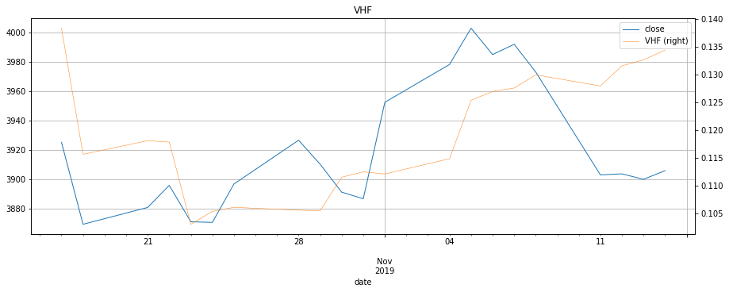

```python
import os
import sys
sys.path.append(os.path.abspath(os.path.join(os.getcwd(), '..')))

import pandas as pd
pd.core.common.is_list_like = pd.api.types.is_list_like
try:
    import empyrical as emp
except:
    emp = None
import tushare as ts
import time
import random
# from concurrent.futures import ProcessPoolExecutor

from common.log import *
from common.config import Config
from spider.spider_nasdaq import Spider_nasdaq
from spider.spider_coinmarketcap import Spider_coinmarketcap

from IPython.core.interactiveshell import InteractiveShell
InteractiveShell.ast_node_interactivity = 'all'

from pandas_highcharts.core import serialize
from pandas_highcharts.display import display_charts

from IPython.core.display import display, HTML
# display(HTML("<style>.container { width:70% !important; }</style>"))

CONF = Config('../conf/secret.yaml').data[0]
ts_token = CONF['TUSHARE']['TOKEN']
ts.set_token(ts_token)
pro = ts.pro_api()

CONF = Config().data[0]
MONGODB = CONF['MONGODB']
NASDAQ = CONF['NASDAQ']
CRYPTOCURRENCY = CONF['CRYPTOCURRENCY']
CRYPTOCURRENCY = list(CRYPTOCURRENCY.keys())
NASDAQ100 = CONF['NASDAQ100']

TEST_LIST = ['399300']

pd
```

    <module 'pandas' from 'd:\\python3\\lib\\site-packages\\pandas\\__init__.py'>


```python
%%time

stock_df_dict = {}

for symbol in TEST_LIST:
    stock_data_file = '../database/market/%s.csv' % symbol
    try:
        stock_df = pd.read_csv(stock_data_file)
    except:
        print(symbol)
        continue

    # 筛选字段
#     stock_df = stock_df.loc[:, ['date', 'open', 'close']]
    
    # 特殊处理，用当天收盘价做判定和交易
#     stock_df['open'] = stock_df['close']

    # 去掉Nasdaq行情首行的当天行情
    if symbol in NASDAQ100:
        stock_df = stock_df.drop([0])

    # 抛弃空值异常值
    stock_df.dropna(axis=0, how='any', inplace=True)

    # 格式化日期
    # 445 ms ± 17.5 ms per loop (mean ± std. dev. of 7 runs, 1 loop each)
    stock_df = stock_df.assign(date=pd.to_datetime(stock_df['date']))  # need .index.to_period('D')

    # 用日期作索引，日期升序排序
    # 95.1 µs ± 1.58 µs per loop (mean ± std. dev. of 7 runs, 10000 loops each)
    if symbol in NASDAQ100 or symbol in CRYPTOCURRENCY:
        stock_df = stock_df[::-1]
    stock_df.set_index(['date'], inplace=True)
    stock_df.index = stock_df.index.to_period('D')

    # 计算每天涨跌幅
#     stock_df['o_pct_chg'] = stock_df.open.pct_change(1)
#     stock_df['c_o_pct_chg'] = (stock_df.open - stock_df.close.shift(1)) / stock_df.close.shift(1)
#     stock_df['N_chg'] = stock_df.open.pct_change(N)
    # 用昨天收盘价做判定
#     stock_df['N_chg'] = (stock_df.close.shift(1) - stock_df.close.shift(N)) / stock_df.close.shift(N)
#     stock_df['N_sht'] = stock_df.open.shift(N)
#     stock_df['N_chn'] = stock_df.open.shift(N) - stock_df.open
#     stock_df['y_close'] = stock_df.close.shift(1)
    
    # MA均线指标
#     stock_df['MA%d' % M] = stock_df['open'].rolling(M).mean()
#     stock_df['MA%d' % M] = stock_df['close'].rolling(M).mean().shift(1)
    
    # 减少数据
    stock_df.dropna(how='any', inplace=True)
    
    stock_df_dict[symbol] = stock_df
```

    Wall time: 32.9 ms
    


```python
for symbol in TEST_LIST:
    symbol
    stock_df_dict[symbol].head(2)
    stock_df_dict[symbol].tail(2)
```


    '399300'


<div>
<style scoped>
    .dataframe tbody tr th:only-of-type {
        vertical-align: middle;
    }

    .dataframe tbody tr th {
        vertical-align: top;
    }

    .dataframe thead th {
        text-align: right;
    }
</style>
<table border="1" class="dataframe">
  <thead>
    <tr style="text-align: right;">
      <th></th>
      <th>open</th>
      <th>close</th>
      <th>high</th>
      <th>low</th>
      <th>volume</th>
      <th>code</th>
    </tr>
    <tr>
      <th>date</th>
      <th></th>
      <th></th>
      <th></th>
      <th></th>
      <th></th>
      <th></th>
    </tr>
  </thead>
  <tbody>
    <tr>
      <th>2005-04-08</th>
      <td>984.66</td>
      <td>1003.45</td>
      <td>1003.70</td>
      <td>979.53</td>
      <td>14762500.0</td>
      <td>sz399300</td>
    </tr>
    <tr>
      <th>2005-04-11</th>
      <td>1003.88</td>
      <td>995.42</td>
      <td>1008.73</td>
      <td>992.77</td>
      <td>15936100.0</td>
      <td>sz399300</td>
    </tr>
  </tbody>
</table>
</div>


<div>
<style scoped>
    .dataframe tbody tr th:only-of-type {
        vertical-align: middle;
    }

    .dataframe tbody tr th {
        vertical-align: top;
    }

    .dataframe thead th {
        text-align: right;
    }
</style>
<table border="1" class="dataframe">
  <thead>
    <tr style="text-align: right;">
      <th></th>
      <th>open</th>
      <th>close</th>
      <th>high</th>
      <th>low</th>
      <th>volume</th>
      <th>code</th>
    </tr>
    <tr>
      <th>date</th>
      <th></th>
      <th></th>
      <th></th>
      <th></th>
      <th></th>
      <th></th>
    </tr>
  </thead>
  <tbody>
    <tr>
      <th>2019-11-13</th>
      <td>3905.28</td>
      <td>3899.98</td>
      <td>3908.42</td>
      <td>3882.43</td>
      <td>76749078.0</td>
      <td>sz399300</td>
    </tr>
    <tr>
      <th>2019-11-14</th>
      <td>3905.93</td>
      <td>3905.86</td>
      <td>3916.95</td>
      <td>3895.14</td>
      <td>87008446.0</td>
      <td>sz399300</td>
    </tr>
  </tbody>
</table>
</div>


```python
'''
Select the number of periods (n) to include in the indicator. 
This should be based on the length of the cycle that you are analyzing. 
The most popular is 28 days (for intermediate cycles).
Determine the highest closing price (HCP) in n periods.
Determine the lowest closing price (LCP) in n periods.
Calculate the range of closing prices in n periods:
           HCP - LCP
Next, calculate the movement in closing price for each period:
           Closing price [today] - Closing price [yesterday]
Add up all price movements for n periods, disregarding whether they are up or down:
           Sum of absolute values of ( Close [today] - Close [yesterday] ) for n periods
Divide Step 4 by Step 6:
           VHF = (HCP - LCP) / (Sum of absolute values for n periods)
'''
```


    '\nSelect the number of periods (n) to include in the indicator. \nThis should be based on the length of the cycle that you are analyzing. \nThe most popular is 28 days (for intermediate cycles).\nDetermine the highest closing price (HCP) in n periods.\nDetermine the lowest closing price (LCP) in n periods.\nCalculate the range of closing prices in n periods:\n           HCP - LCP\nNext, calculate the movement in closing price for each period:\n           Closing price [today] - Closing price [yesterday]\nAdd up all price movements for n periods, disregarding whether they are up or down:\n           Sum of absolute values of ( Close [today] - Close [yesterday] ) for n periods\nDivide Step 4 by Step 6:\n           VHF = (HCP - LCP) / (Sum of absolute values for n periods)\n'


```python
df = stock_df_dict['399300'].copy()
N = 120
df['CLOSE_MA'] = df['close'].rolling(N).mean()
# df['close'] = df['CLOSE_MA']
df['HCP'] = df['close'].rolling(N).max()
df['LCP'] = df['close'].rolling(N).min()
df['DIFFCP'] = df['close'] - df['close'].shift()
df['DIFFCP'] = df['DIFFCP'].apply(abs)
df['SUMDIFFCP'] = df['DIFFCP'].rolling(N).sum()
df['VHF'] = (df['HCP'] - df['LCP']) / df['SUMDIFFCP']
df['VHF_MA'] = df['VHF'].rolling(N).mean()
df
o_df = df.copy()
```


<div>
<style scoped>
    .dataframe tbody tr th:only-of-type {
        vertical-align: middle;
    }

    .dataframe tbody tr th {
        vertical-align: top;
    }

    .dataframe thead th {
        text-align: right;
    }
</style>
<table border="1" class="dataframe">
  <thead>
    <tr style="text-align: right;">
      <th></th>
      <th>open</th>
      <th>close</th>
      <th>high</th>
      <th>low</th>
      <th>volume</th>
      <th>code</th>
      <th>CLOSE_MA</th>
      <th>HCP</th>
      <th>LCP</th>
      <th>DIFFCP</th>
      <th>SUMDIFFCP</th>
      <th>VHF</th>
      <th>VHF_MA</th>
    </tr>
    <tr>
      <th>date</th>
      <th></th>
      <th></th>
      <th></th>
      <th></th>
      <th></th>
      <th></th>
      <th></th>
      <th></th>
      <th></th>
      <th></th>
      <th></th>
      <th></th>
      <th></th>
    </tr>
  </thead>
  <tbody>
    <tr>
      <th>2005-04-08</th>
      <td>984.66</td>
      <td>1003.45</td>
      <td>1003.70</td>
      <td>979.53</td>
      <td>14762500.0</td>
      <td>sz399300</td>
      <td>NaN</td>
      <td>NaN</td>
      <td>NaN</td>
      <td>NaN</td>
      <td>NaN</td>
      <td>NaN</td>
      <td>NaN</td>
    </tr>
    <tr>
      <th>2005-04-11</th>
      <td>1003.88</td>
      <td>995.42</td>
      <td>1008.73</td>
      <td>992.77</td>
      <td>15936100.0</td>
      <td>sz399300</td>
      <td>NaN</td>
      <td>NaN</td>
      <td>NaN</td>
      <td>8.03</td>
      <td>NaN</td>
      <td>NaN</td>
      <td>NaN</td>
    </tr>
    <tr>
      <th>2005-04-12</th>
      <td>993.71</td>
      <td>978.70</td>
      <td>993.71</td>
      <td>978.20</td>
      <td>10226200.0</td>
      <td>sz399300</td>
      <td>NaN</td>
      <td>NaN</td>
      <td>NaN</td>
      <td>16.72</td>
      <td>NaN</td>
      <td>NaN</td>
      <td>NaN</td>
    </tr>
    <tr>
      <th>2005-04-13</th>
      <td>987.95</td>
      <td>1000.90</td>
      <td>1006.50</td>
      <td>987.95</td>
      <td>16071700.0</td>
      <td>sz399300</td>
      <td>NaN</td>
      <td>NaN</td>
      <td>NaN</td>
      <td>22.20</td>
      <td>NaN</td>
      <td>NaN</td>
      <td>NaN</td>
    </tr>
    <tr>
      <th>2005-04-14</th>
      <td>1004.64</td>
      <td>986.97</td>
      <td>1006.42</td>
      <td>985.58</td>
      <td>12945700.0</td>
      <td>sz399300</td>
      <td>NaN</td>
      <td>NaN</td>
      <td>NaN</td>
      <td>13.93</td>
      <td>NaN</td>
      <td>NaN</td>
      <td>NaN</td>
    </tr>
    <tr>
      <th>2005-04-15</th>
      <td>982.61</td>
      <td>974.08</td>
      <td>982.61</td>
      <td>971.93</td>
      <td>10409000.0</td>
      <td>sz399300</td>
      <td>NaN</td>
      <td>NaN</td>
      <td>NaN</td>
      <td>12.89</td>
      <td>NaN</td>
      <td>NaN</td>
      <td>NaN</td>
    </tr>
    <tr>
      <th>2005-04-18</th>
      <td>970.91</td>
      <td>963.77</td>
      <td>970.91</td>
      <td>958.65</td>
      <td>8598400.0</td>
      <td>sz399300</td>
      <td>NaN</td>
      <td>NaN</td>
      <td>NaN</td>
      <td>10.31</td>
      <td>NaN</td>
      <td>NaN</td>
      <td>NaN</td>
    </tr>
    <tr>
      <th>2005-04-19</th>
      <td>962.92</td>
      <td>965.89</td>
      <td>968.87</td>
      <td>957.91</td>
      <td>9212620.0</td>
      <td>sz399300</td>
      <td>NaN</td>
      <td>NaN</td>
      <td>NaN</td>
      <td>2.12</td>
      <td>NaN</td>
      <td>NaN</td>
      <td>NaN</td>
    </tr>
    <tr>
      <th>2005-04-20</th>
      <td>964.15</td>
      <td>950.87</td>
      <td>964.15</td>
      <td>946.20</td>
      <td>8850700.0</td>
      <td>sz399300</td>
      <td>NaN</td>
      <td>NaN</td>
      <td>NaN</td>
      <td>15.02</td>
      <td>NaN</td>
      <td>NaN</td>
      <td>NaN</td>
    </tr>
    <tr>
      <th>2005-04-21</th>
      <td>948.86</td>
      <td>943.98</td>
      <td>955.55</td>
      <td>938.59</td>
      <td>9946150.0</td>
      <td>sz399300</td>
      <td>NaN</td>
      <td>NaN</td>
      <td>NaN</td>
      <td>6.89</td>
      <td>NaN</td>
      <td>NaN</td>
      <td>NaN</td>
    </tr>
    <tr>
      <th>2005-04-22</th>
      <td>942.91</td>
      <td>939.10</td>
      <td>947.91</td>
      <td>934.96</td>
      <td>10691900.0</td>
      <td>sz399300</td>
      <td>NaN</td>
      <td>NaN</td>
      <td>NaN</td>
      <td>4.88</td>
      <td>NaN</td>
      <td>NaN</td>
      <td>NaN</td>
    </tr>
    <tr>
      <th>2005-04-25</th>
      <td>935.99</td>
      <td>930.07</td>
      <td>935.99</td>
      <td>920.16</td>
      <td>11470500.0</td>
      <td>sz399300</td>
      <td>NaN</td>
      <td>NaN</td>
      <td>NaN</td>
      <td>9.03</td>
      <td>NaN</td>
      <td>NaN</td>
      <td>NaN</td>
    </tr>
    <tr>
      <th>2005-04-26</th>
      <td>928.43</td>
      <td>937.08</td>
      <td>939.70</td>
      <td>924.66</td>
      <td>11690500.0</td>
      <td>sz399300</td>
      <td>NaN</td>
      <td>NaN</td>
      <td>NaN</td>
      <td>7.01</td>
      <td>NaN</td>
      <td>NaN</td>
      <td>NaN</td>
    </tr>
    <tr>
      <th>2005-04-27</th>
      <td>938.57</td>
      <td>926.60</td>
      <td>938.91</td>
      <td>925.90</td>
      <td>10780600.0</td>
      <td>sz399300</td>
      <td>NaN</td>
      <td>NaN</td>
      <td>NaN</td>
      <td>10.48</td>
      <td>NaN</td>
      <td>NaN</td>
      <td>NaN</td>
    </tr>
    <tr>
      <th>2005-04-28</th>
      <td>923.53</td>
      <td>942.07</td>
      <td>945.50</td>
      <td>914.83</td>
      <td>14343500.0</td>
      <td>sz399300</td>
      <td>NaN</td>
      <td>NaN</td>
      <td>NaN</td>
      <td>15.47</td>
      <td>NaN</td>
      <td>NaN</td>
      <td>NaN</td>
    </tr>
    <tr>
      <th>2005-04-29</th>
      <td>940.81</td>
      <td>932.40</td>
      <td>942.45</td>
      <td>929.81</td>
      <td>11235400.0</td>
      <td>sz399300</td>
      <td>NaN</td>
      <td>NaN</td>
      <td>NaN</td>
      <td>9.67</td>
      <td>NaN</td>
      <td>NaN</td>
      <td>NaN</td>
    </tr>
    <tr>
      <th>2005-05-09</th>
      <td>934.65</td>
      <td>909.17</td>
      <td>937.39</td>
      <td>909.17</td>
      <td>8529110.0</td>
      <td>sz399300</td>
      <td>NaN</td>
      <td>NaN</td>
      <td>NaN</td>
      <td>23.23</td>
      <td>NaN</td>
      <td>NaN</td>
      <td>NaN</td>
    </tr>
    <tr>
      <th>2005-05-10</th>
      <td>905.54</td>
      <td>913.08</td>
      <td>913.39</td>
      <td>892.31</td>
      <td>10494300.0</td>
      <td>sz399300</td>
      <td>NaN</td>
      <td>NaN</td>
      <td>NaN</td>
      <td>3.91</td>
      <td>NaN</td>
      <td>NaN</td>
      <td>NaN</td>
    </tr>
    <tr>
      <th>2005-05-11</th>
      <td>911.84</td>
      <td>901.85</td>
      <td>917.22</td>
      <td>900.44</td>
      <td>9042050.0</td>
      <td>sz399300</td>
      <td>NaN</td>
      <td>NaN</td>
      <td>NaN</td>
      <td>11.23</td>
      <td>NaN</td>
      <td>NaN</td>
      <td>NaN</td>
    </tr>
    <tr>
      <th>2005-05-12</th>
      <td>899.97</td>
      <td>885.82</td>
      <td>900.06</td>
      <td>883.51</td>
      <td>10228700.0</td>
      <td>sz399300</td>
      <td>NaN</td>
      <td>NaN</td>
      <td>NaN</td>
      <td>16.03</td>
      <td>NaN</td>
      <td>NaN</td>
      <td>NaN</td>
    </tr>
    <tr>
      <th>2005-05-13</th>
      <td>883.51</td>
      <td>887.54</td>
      <td>898.51</td>
      <td>875.58</td>
      <td>11244900.0</td>
      <td>sz399300</td>
      <td>NaN</td>
      <td>NaN</td>
      <td>NaN</td>
      <td>1.72</td>
      <td>NaN</td>
      <td>NaN</td>
      <td>NaN</td>
    </tr>
    <tr>
      <th>2005-05-16</th>
      <td>885.39</td>
      <td>875.27</td>
      <td>885.39</td>
      <td>869.33</td>
      <td>8224289.0</td>
      <td>sz399300</td>
      <td>NaN</td>
      <td>NaN</td>
      <td>NaN</td>
      <td>12.27</td>
      <td>NaN</td>
      <td>NaN</td>
      <td>NaN</td>
    </tr>
    <tr>
      <th>2005-05-17</th>
      <td>873.08</td>
      <td>881.46</td>
      <td>888.28</td>
      <td>868.21</td>
      <td>8772270.0</td>
      <td>sz399300</td>
      <td>NaN</td>
      <td>NaN</td>
      <td>NaN</td>
      <td>6.19</td>
      <td>NaN</td>
      <td>NaN</td>
      <td>NaN</td>
    </tr>
    <tr>
      <th>2005-05-18</th>
      <td>881.14</td>
      <td>883.20</td>
      <td>890.40</td>
      <td>871.82</td>
      <td>7878610.0</td>
      <td>sz399300</td>
      <td>NaN</td>
      <td>NaN</td>
      <td>NaN</td>
      <td>1.74</td>
      <td>NaN</td>
      <td>NaN</td>
      <td>NaN</td>
    </tr>
    <tr>
      <th>2005-05-19</th>
      <td>882.84</td>
      <td>884.17</td>
      <td>888.02</td>
      <td>871.29</td>
      <td>8149579.0</td>
      <td>sz399300</td>
      <td>NaN</td>
      <td>NaN</td>
      <td>NaN</td>
      <td>0.97</td>
      <td>NaN</td>
      <td>NaN</td>
      <td>NaN</td>
    </tr>
    <tr>
      <th>2005-05-20</th>
      <td>883.51</td>
      <td>882.76</td>
      <td>891.02</td>
      <td>879.18</td>
      <td>7226679.0</td>
      <td>sz399300</td>
      <td>NaN</td>
      <td>NaN</td>
      <td>NaN</td>
      <td>1.41</td>
      <td>NaN</td>
      <td>NaN</td>
      <td>NaN</td>
    </tr>
    <tr>
      <th>2005-05-23</th>
      <td>880.28</td>
      <td>863.34</td>
      <td>880.28</td>
      <td>862.10</td>
      <td>7279800.0</td>
      <td>sz399300</td>
      <td>NaN</td>
      <td>NaN</td>
      <td>NaN</td>
      <td>19.42</td>
      <td>NaN</td>
      <td>NaN</td>
      <td>NaN</td>
    </tr>
    <tr>
      <th>2005-05-24</th>
      <td>861.20</td>
      <td>868.46</td>
      <td>871.77</td>
      <td>855.59</td>
      <td>9206929.0</td>
      <td>sz399300</td>
      <td>NaN</td>
      <td>NaN</td>
      <td>NaN</td>
      <td>5.12</td>
      <td>NaN</td>
      <td>NaN</td>
      <td>NaN</td>
    </tr>
    <tr>
      <th>2005-05-25</th>
      <td>867.66</td>
      <td>868.45</td>
      <td>876.30</td>
      <td>861.66</td>
      <td>7238560.0</td>
      <td>sz399300</td>
      <td>NaN</td>
      <td>NaN</td>
      <td>NaN</td>
      <td>0.01</td>
      <td>NaN</td>
      <td>NaN</td>
      <td>NaN</td>
    </tr>
    <tr>
      <th>2005-05-26</th>
      <td>867.76</td>
      <td>857.33</td>
      <td>872.84</td>
      <td>854.96</td>
      <td>6622789.0</td>
      <td>sz399300</td>
      <td>NaN</td>
      <td>NaN</td>
      <td>NaN</td>
      <td>11.12</td>
      <td>NaN</td>
      <td>NaN</td>
      <td>NaN</td>
    </tr>
    <tr>
      <th>...</th>
      <td>...</td>
      <td>...</td>
      <td>...</td>
      <td>...</td>
      <td>...</td>
      <td>...</td>
      <td>...</td>
      <td>...</td>
      <td>...</td>
      <td>...</td>
      <td>...</td>
      <td>...</td>
      <td>...</td>
    </tr>
    <tr>
      <th>2019-09-27</th>
      <td>3843.46</td>
      <td>3852.65</td>
      <td>3859.50</td>
      <td>3832.25</td>
      <td>74003947.0</td>
      <td>sz399300</td>
      <td>3805.445500</td>
      <td>4120.61</td>
      <td>3564.68</td>
      <td>11.51</td>
      <td>4077.60</td>
      <td>0.136338</td>
      <td>0.200318</td>
    </tr>
    <tr>
      <th>2019-09-30</th>
      <td>3842.07</td>
      <td>3814.53</td>
      <td>3857.23</td>
      <td>3813.55</td>
      <td>65931313.0</td>
      <td>sz399300</td>
      <td>3803.423000</td>
      <td>4120.61</td>
      <td>3564.68</td>
      <td>38.12</td>
      <td>4110.72</td>
      <td>0.135239</td>
      <td>0.199494</td>
    </tr>
    <tr>
      <th>2019-10-08</th>
      <td>3818.59</td>
      <td>3837.68</td>
      <td>3861.64</td>
      <td>3818.59</td>
      <td>76657860.0</td>
      <td>sz399300</td>
      <td>3801.441750</td>
      <td>4120.61</td>
      <td>3564.68</td>
      <td>23.15</td>
      <td>4115.67</td>
      <td>0.135076</td>
      <td>0.198651</td>
    </tr>
    <tr>
      <th>2019-10-09</th>
      <td>3822.61</td>
      <td>3843.24</td>
      <td>3845.34</td>
      <td>3805.07</td>
      <td>75854512.0</td>
      <td>sz399300</td>
      <td>3799.420000</td>
      <td>4120.61</td>
      <td>3564.68</td>
      <td>5.56</td>
      <td>4110.81</td>
      <td>0.135236</td>
      <td>0.197726</td>
    </tr>
    <tr>
      <th>2019-10-10</th>
      <td>3838.49</td>
      <td>3874.64</td>
      <td>3877.14</td>
      <td>3829.43</td>
      <td>79222694.0</td>
      <td>sz399300</td>
      <td>3798.395500</td>
      <td>4120.61</td>
      <td>3564.68</td>
      <td>31.40</td>
      <td>4053.94</td>
      <td>0.137133</td>
      <td>0.196836</td>
    </tr>
    <tr>
      <th>2019-10-11</th>
      <td>3885.52</td>
      <td>3911.73</td>
      <td>3922.37</td>
      <td>3868.84</td>
      <td>93412577.0</td>
      <td>sz399300</td>
      <td>3797.754750</td>
      <td>4120.61</td>
      <td>3564.68</td>
      <td>37.09</td>
      <td>4082.07</td>
      <td>0.136188</td>
      <td>0.195921</td>
    </tr>
    <tr>
      <th>2019-10-14</th>
      <td>3944.86</td>
      <td>3953.24</td>
      <td>3983.81</td>
      <td>3934.73</td>
      <td>122393611.0</td>
      <td>sz399300</td>
      <td>3797.569083</td>
      <td>4120.61</td>
      <td>3564.68</td>
      <td>41.51</td>
      <td>4110.48</td>
      <td>0.135247</td>
      <td>0.194994</td>
    </tr>
    <tr>
      <th>2019-10-15</th>
      <td>3953.16</td>
      <td>3936.25</td>
      <td>3953.16</td>
      <td>3928.15</td>
      <td>85273949.0</td>
      <td>sz399300</td>
      <td>3796.322917</td>
      <td>4120.61</td>
      <td>3564.68</td>
      <td>16.99</td>
      <td>4017.20</td>
      <td>0.138387</td>
      <td>0.194134</td>
    </tr>
    <tr>
      <th>2019-10-16</th>
      <td>3939.28</td>
      <td>3922.69</td>
      <td>3964.05</td>
      <td>3919.02</td>
      <td>83229707.0</td>
      <td>sz399300</td>
      <td>3794.951667</td>
      <td>4120.61</td>
      <td>3564.68</td>
      <td>13.56</td>
      <td>4029.31</td>
      <td>0.137972</td>
      <td>0.193236</td>
    </tr>
    <tr>
      <th>2019-10-17</th>
      <td>3929.39</td>
      <td>3925.22</td>
      <td>3935.81</td>
      <td>3913.92</td>
      <td>64863745.0</td>
      <td>sz399300</td>
      <td>3793.727833</td>
      <td>4120.61</td>
      <td>3564.68</td>
      <td>2.53</td>
      <td>4016.68</td>
      <td>0.138405</td>
      <td>0.192307</td>
    </tr>
    <tr>
      <th>2019-10-18</th>
      <td>3935.42</td>
      <td>3869.38</td>
      <td>3940.54</td>
      <td>3864.97</td>
      <td>82321140.0</td>
      <td>sz399300</td>
      <td>3791.634250</td>
      <td>4030.09</td>
      <td>3564.68</td>
      <td>55.84</td>
      <td>4023.99</td>
      <td>0.115659</td>
      <td>0.191084</td>
    </tr>
    <tr>
      <th>2019-10-21</th>
      <td>3865.34</td>
      <td>3880.84</td>
      <td>3884.74</td>
      <td>3856.04</td>
      <td>74182918.0</td>
      <td>sz399300</td>
      <td>3790.427833</td>
      <td>4030.09</td>
      <td>3564.68</td>
      <td>11.46</td>
      <td>3940.45</td>
      <td>0.118111</td>
      <td>0.189886</td>
    </tr>
    <tr>
      <th>2019-10-22</th>
      <td>3896.31</td>
      <td>3895.88</td>
      <td>3897.44</td>
      <td>3870.55</td>
      <td>68918566.0</td>
      <td>sz399300</td>
      <td>3789.401750</td>
      <td>4030.09</td>
      <td>3564.68</td>
      <td>15.04</td>
      <td>3948.89</td>
      <td>0.117858</td>
      <td>0.188687</td>
    </tr>
    <tr>
      <th>2019-10-23</th>
      <td>3892.68</td>
      <td>3871.08</td>
      <td>3901.42</td>
      <td>3862.20</td>
      <td>70198625.0</td>
      <td>sz399300</td>
      <td>3788.076667</td>
      <td>3972.95</td>
      <td>3564.68</td>
      <td>24.80</td>
      <td>3962.61</td>
      <td>0.103031</td>
      <td>0.187367</td>
    </tr>
    <tr>
      <th>2019-10-24</th>
      <td>3877.92</td>
      <td>3870.67</td>
      <td>3890.20</td>
      <td>3852.58</td>
      <td>71334575.0</td>
      <td>sz399300</td>
      <td>3787.483750</td>
      <td>3972.95</td>
      <td>3564.68</td>
      <td>0.41</td>
      <td>3874.75</td>
      <td>0.105367</td>
      <td>0.186099</td>
    </tr>
    <tr>
      <th>2019-10-25</th>
      <td>3871.77</td>
      <td>3896.79</td>
      <td>3899.72</td>
      <td>3849.03</td>
      <td>77453620.0</td>
      <td>sz399300</td>
      <td>3787.546417</td>
      <td>3972.95</td>
      <td>3564.68</td>
      <td>26.12</td>
      <td>3848.32</td>
      <td>0.106090</td>
      <td>0.184815</td>
    </tr>
    <tr>
      <th>2019-10-28</th>
      <td>3904.98</td>
      <td>3926.58</td>
      <td>3927.80</td>
      <td>3897.82</td>
      <td>97406020.0</td>
      <td>sz399300</td>
      <td>3787.765167</td>
      <td>3972.95</td>
      <td>3564.68</td>
      <td>29.79</td>
      <td>3867.05</td>
      <td>0.105577</td>
      <td>0.183517</td>
    </tr>
    <tr>
      <th>2019-10-29</th>
      <td>3929.71</td>
      <td>3910.23</td>
      <td>3932.37</td>
      <td>3910.23</td>
      <td>82257075.0</td>
      <td>sz399300</td>
      <td>3787.740333</td>
      <td>3972.95</td>
      <td>3564.68</td>
      <td>16.35</td>
      <td>3870.52</td>
      <td>0.105482</td>
      <td>0.182202</td>
    </tr>
    <tr>
      <th>2019-10-30</th>
      <td>3904.72</td>
      <td>3891.23</td>
      <td>3908.10</td>
      <td>3883.45</td>
      <td>77872923.0</td>
      <td>sz399300</td>
      <td>3789.462083</td>
      <td>3972.95</td>
      <td>3564.68</td>
      <td>19.00</td>
      <td>3660.93</td>
      <td>0.111521</td>
      <td>0.181036</td>
    </tr>
    <tr>
      <th>2019-10-31</th>
      <td>3906.86</td>
      <td>3886.75</td>
      <td>3907.15</td>
      <td>3878.88</td>
      <td>86714539.0</td>
      <td>sz399300</td>
      <td>3790.846083</td>
      <td>3972.95</td>
      <td>3564.68</td>
      <td>4.48</td>
      <td>3629.36</td>
      <td>0.112491</td>
      <td>0.179842</td>
    </tr>
    <tr>
      <th>2019-11-01</th>
      <td>3883.81</td>
      <td>3952.39</td>
      <td>3956.08</td>
      <td>3876.42</td>
      <td>100689612.0</td>
      <td>sz399300</td>
      <td>3793.220500</td>
      <td>3972.95</td>
      <td>3564.68</td>
      <td>65.64</td>
      <td>3641.79</td>
      <td>0.112107</td>
      <td>0.178657</td>
    </tr>
    <tr>
      <th>2019-11-04</th>
      <td>3964.01</td>
      <td>3978.12</td>
      <td>3985.36</td>
      <td>3964.01</td>
      <td>104193855.0</td>
      <td>sz399300</td>
      <td>3796.374000</td>
      <td>3978.12</td>
      <td>3564.68</td>
      <td>25.73</td>
      <td>3599.76</td>
      <td>0.114852</td>
      <td>0.177517</td>
    </tr>
    <tr>
      <th>2019-11-05</th>
      <td>3982.12</td>
      <td>4002.81</td>
      <td>4030.64</td>
      <td>3970.87</td>
      <td>112911880.0</td>
      <td>sz399300</td>
      <td>3798.643667</td>
      <td>4002.81</td>
      <td>3564.68</td>
      <td>24.69</td>
      <td>3493.70</td>
      <td>0.125406</td>
      <td>0.176514</td>
    </tr>
    <tr>
      <th>2019-11-06</th>
      <td>4006.33</td>
      <td>3984.88</td>
      <td>4007.50</td>
      <td>3973.78</td>
      <td>97312952.0</td>
      <td>sz399300</td>
      <td>3801.278250</td>
      <td>4002.81</td>
      <td>3564.68</td>
      <td>17.93</td>
      <td>3449.91</td>
      <td>0.126998</td>
      <td>0.175546</td>
    </tr>
    <tr>
      <th>2019-11-07</th>
      <td>3984.55</td>
      <td>3991.88</td>
      <td>4005.38</td>
      <td>3975.55</td>
      <td>87254898.0</td>
      <td>sz399300</td>
      <td>3804.167667</td>
      <td>4002.81</td>
      <td>3564.68</td>
      <td>7.00</td>
      <td>3433.33</td>
      <td>0.127611</td>
      <td>0.174575</td>
    </tr>
    <tr>
      <th>2019-11-08</th>
      <td>4017.67</td>
      <td>3973.01</td>
      <td>4022.04</td>
      <td>3971.57</td>
      <td>97106948.0</td>
      <td>sz399300</td>
      <td>3806.217000</td>
      <td>4002.81</td>
      <td>3564.68</td>
      <td>18.87</td>
      <td>3370.26</td>
      <td>0.129999</td>
      <td>0.173642</td>
    </tr>
    <tr>
      <th>2019-11-11</th>
      <td>3948.62</td>
      <td>3902.98</td>
      <td>3948.62</td>
      <td>3897.55</td>
      <td>94155621.0</td>
      <td>sz399300</td>
      <td>3807.542167</td>
      <td>4002.81</td>
      <td>3564.68</td>
      <td>70.03</td>
      <td>3423.42</td>
      <td>0.127980</td>
      <td>0.172686</td>
    </tr>
    <tr>
      <th>2019-11-12</th>
      <td>3905.96</td>
      <td>3903.69</td>
      <td>3914.88</td>
      <td>3877.74</td>
      <td>76543069.0</td>
      <td>sz399300</td>
      <td>3809.666583</td>
      <td>4002.81</td>
      <td>3564.68</td>
      <td>0.71</td>
      <td>3328.93</td>
      <td>0.131613</td>
      <td>0.171787</td>
    </tr>
    <tr>
      <th>2019-11-13</th>
      <td>3905.28</td>
      <td>3899.98</td>
      <td>3908.42</td>
      <td>3882.43</td>
      <td>76749078.0</td>
      <td>sz399300</td>
      <td>3812.018167</td>
      <td>4002.81</td>
      <td>3564.68</td>
      <td>3.71</td>
      <td>3301.67</td>
      <td>0.132700</td>
      <td>0.170894</td>
    </tr>
    <tr>
      <th>2019-11-14</th>
      <td>3905.93</td>
      <td>3905.86</td>
      <td>3916.95</td>
      <td>3895.14</td>
      <td>87008446.0</td>
      <td>sz399300</td>
      <td>3814.010500</td>
      <td>4002.81</td>
      <td>3564.68</td>
      <td>5.88</td>
      <td>3258.56</td>
      <td>0.134455</td>
      <td>0.170029</td>
    </tr>
  </tbody>
</table>
<p>3551 rows × 13 columns</p>
</div>


```python
%matplotlib inline

import matplotlib
import matplotlib.pyplot as plt
plt.rcParams['figure.figsize'] = [15, 5]

df = o_df.copy()
df = df.iloc[3530:]
# df = o_df.loc[:, ['close', 'VHF_MA20']].copy()
# df.drop(columns=['PROPERTY'], inplace=True)
df.columns
df = df.dropna(how='any', inplace=False)

show_columns = ['close', 'VHF']
df = df.loc[:, show_columns]

# df['close'] = (df['close'] - df.iloc[0]['close']) / df.iloc[0]['close']
ax = df.plot(kind='line', y='close', title='VHF', linewidth=1, grid=True)
# ax = df.plot(kind='line', y='CLOSE_MA', secondary_y=False, title='VHF_N%d' % N, linewidth=1, grid=True)
ax = df.plot(kind='line', y='VHF', secondary_y=True, title='VHF', linewidth=0.5, grid=True, ax=ax)
```


    Index(['open', 'close', 'high', 'low', 'volume', 'code', 'CLOSE_MA', 'HCP',
           'LCP', 'DIFFCP', 'SUMDIFFCP', 'VHF', 'VHF_MA'],
          dtype='object')





```python
df.reset_index(drop=False, inplace=True)
df['date'] = df['date'].apply(lambda x: x.to_timestamp().to_datetime64())
df.set_index(keys=['date'], inplace=True)

display_charts(df, secondary_y=['VHF'], chart_type='stock', kind='line', figsize=(900, 600), logy=False)
```


<div id="chart_idtAKCqjtX"></div>


<script>
onsole.log('Highcharts begin')

new Highcharts.StockChart({"chart":{"renderTo":"chart_idtAKCqjtX","width":900,"height":600,"type":"line"},"legend":{"enabled":true},"series":[{"name":"VHF (right)","yAxis":1,"data":[[1571270400000,0.1384053497],[1571356800000,0.1156588361],[1571616000000,0.1181108757],[1571702400000,0.1178584362],[1571788800000,0.1030305783],[1571875200000,0.1053667979],[1571961600000,0.1060904499],[1572220800000,0.1055766023],[1572307200000,0.1054819507],[1572393600000,0.1115208431],[1572480000000,0.1124909075],[1572566400000,0.1121069584],[1572825600000,0.1148521013],[1572912000000,0.1254057303],[1572998400000,0.1269975159],[1573084800000,0.1276108035],[1573171200000,0.1299988725],[1573430400000,0.1279802069],[1573516800000,0.1316128606],[1573603200000,0.1326995127],[1573689600000,0.1344550967]]},{"name":"close","yAxis":0,"data":[[1571270400000,3925.22],[1571356800000,3869.38],[1571616000000,3880.84],[1571702400000,3895.88],[1571788800000,3871.08],[1571875200000,3870.67],[1571961600000,3896.79],[1572220800000,3926.58],[1572307200000,3910.23],[1572393600000,3891.23],[1572480000000,3886.75],[1572566400000,3952.39],[1572825600000,3978.12],[1572912000000,4002.81],[1572998400000,3984.88],[1573084800000,3991.88],[1573171200000,3973.01],[1573430400000,3902.98],[1573516800000,3903.69],[1573603200000,3899.98],[1573689600000,3905.86]]}],"xAxis":{"title":{"text":"date"},"type":"datetime"},"yAxis":[{},{"opposite":true}]});

onsole.log('Highcharts end')
</script>

## This is test

<script>
  console.log(2333)
</script>